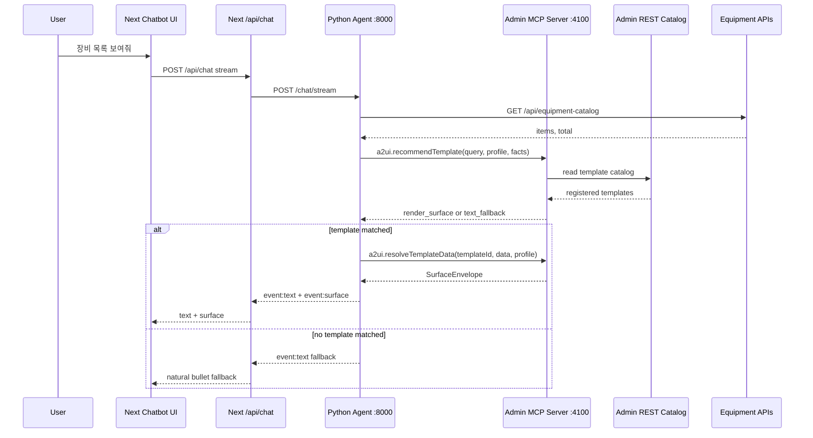

# Real Agent + Admin MCP + Python Agent Integration Plan

Date: 2026-06-09

Related reference:

- `/Users/tahooki/Documents/git/a2ui-poc-rt-new-3/packages/a2ui-admin/src/mcp-server/server.ts`
- `/Users/tahooki/Documents/git/a2ui-poc-rt-new-3/packages/a2ui-admin/src/mcp-server/tools/register-tools.ts`
- `/Users/tahooki/Documents/git/a2ui-poc-rt-new-3/packages/a2ui-admin/src/mcp-server/runtime/resolve-template.ts`
- `/Users/tahooki/Documents/git/a2ui-poc-rt-new-3/packages/demo-agent-server/app/a2ui_agent.py`
- `/Users/tahooki/Documents/git/a2ui-poc-rt-new-3/packages/demo-agent-server/app/orchestrate.py`
- `/Users/tahooki/Documents/git/a2ui-poc-rt-new-3/src/app/api/chat/route.ts`
- `/Users/tahooki/Documents/git/a2ui-poc-rt-new-3/src/devops-chat/data-a2ui/`

## 1. 목적

기존 `a2ui-template-admin-chatbot-poc`는 한 화면 안에서 Admin이 등록한 템플릿을 React state/localStorage로 저장하고, 오른쪽 Chatbot이 deterministic mock logic으로 A2UI를 선택했다.

다음 단계는 이 구조를 실제 Agent 대화형 POC로 확장하는 것이다.

목표는 다음 장면을 증명하는 것이다.

1. Admin에서 A2UI 템플릿을 등록한다.
2. 등록 내용은 localStorage가 아니라 서버 catalog에 저장된다.
3. Admin MCP 서버가 catalog를 MCP tool로 노출한다.
4. Python Agent가 사용자 질문을 받고 장비 API를 호출하거나 facts를 만든다.
5. Python Agent가 MCP에 어떤 A2UI를 쓸지 묻는다.
6. MCP가 catalog, resolver, schema validation을 통해 SurfaceEnvelope 또는 text fallback을 반환한다.
7. Chatbot은 Python Agent SSE 응답을 받아 실제 대화처럼 텍스트와 A2UI surface를 표시한다.

즉, “하드코딩된 목 챗봇”에서 “Admin MCP에 등록된 템플릿을 실제 Agent가 호출하는 POC”로 넘어간다.

## 1.1 전체 구조 흐름

화면은 지금처럼 한 페이지 POC를 유지한다. 왼쪽은 Admin UI, 오른쪽은 Chatbot UI다. 달라지는 지점은 Chatbot이 더 이상 브라우저 안의 mock logic으로 데이터와 템플릿을 직접 비교하지 않는다는 점이다. 사용자의 질문은 실제 Agent backend로 넘어가고, Agent가 장비 API와 Admin MCP를 호출해 응답을 만든다.

큰 구조는 다음과 같다.

```text
Next.js 화면
  ├─ 왼쪽 Admin UI
  └─ 오른쪽 Chatbot UI

Admin MCP Server
  ├─ template catalog 저장
  ├─ Admin REST API
  └─ MCP tools

Python Agent
  ├─ 사용자 질문 이해
  ├─ 장비 API 호출
  ├─ MCP에 A2UI 추천/렌더 요청
  └─ 텍스트 또는 surface를 streaming 응답
```

사용자 흐름은 다음 순서로 동작한다.

1. 사용자는 오른쪽 Chatbot에 `장비 목록 보여줘`라고 말한다.
2. Chatbot UI는 직접 데이터를 고르거나 템플릿을 비교하지 않는다.
3. Next `/api/chat`이 Python Agent `/chat/stream`으로 요청을 넘긴다.
4. Python Agent가 “이건 장비 카탈로그 요청”이라고 판단한다.
5. Python Agent가 `/api/equipment-catalog`를 호출해서 장비 데이터를 확보한다.
6. Python Agent가 데이터 profile을 만든다.
   - 예: `imageUrl` 있음
   - 예: `name` 있음
   - 예: `description` 있음
   - 예: 총 44개 row
7. Python Agent가 Admin MCP Server에 묻는다.
   - “이 사용자 요청과 이 데이터 profile이면 어떤 A2UI 템플릿을 써야 하는가?”
8. Admin MCP Server가 catalog에 등록된 템플릿을 확인한다.
9. 이미지 카드 템플릿이 없으면 MCP는 `text_fallback` 판단을 반환한다.
10. Python Agent가 장비 API 데이터를 기반으로 bullet point fallback을 작성해 Chatbot에 stream한다.
11. 사용자가 왼쪽 Admin에서 이미지 카드 템플릿을 등록한다.
12. Admin 저장은 localStorage가 아니라 Admin MCP Server catalog에 반영된다.
13. 기존 chat transcript는 자동으로 바뀌지 않고 그대로 유지된다.
14. 사용자가 다시 `장비 목록`을 요청한다.
15. Python Agent가 다시 데이터를 가져오고 MCP에 추천을 요청한다.
16. 이번에는 MCP가 `equipment.imageCardList`를 선택한다.
17. MCP가 `SurfaceEnvelope`를 만들어 Python Agent에 반환한다.
18. Python Agent가 text event와 surface event를 Chatbot에 stream한다.
19. Chatbot UI가 A2UI 이미지 카드 목록을 렌더링한다.

역할 분리는 다음을 지킨다.

| 영역 | 책임 |
| --- | --- |
| Next UI | Admin 화면과 Chatbot 화면을 보여준다. 판단은 하지 않는다. |
| Admin MCP Server | 템플릿 저장소이자 A2UI 추천/resolve 엔진이다. |
| Python Agent | 실제 대화 주체다. 질문 이해, 데이터 조회, MCP 호출을 담당한다. |
| Equipment API | Agent가 호출하는 실제 tool/data source 역할을 한다. |
| Renderer | MCP가 준 surface를 화면으로 그린다. |

이 구조가 만들어지면 데모 메시지는 다음처럼 정리된다.

```text
Admin에 템플릿을 등록하면,
Agent가 다음 대화에서 MCP catalog를 보고
어떤 A2UI를 쓸지 판단한다.
```

중요한 시연 원칙은 “저장하자마자 기존 chat이 바뀌는 것”이 아니다. 저장은 catalog만 바꾸고, Agent가 다음 요청을 처리할 때 새 catalog를 실제로 사용해야 한다.

## 1.2 TODO List

이 TODO는 개발자가 바로 작업 순서를 따라갈 수 있도록 정리한 실행 목록이다. 아래 순서대로 진행하면 현재 mock/localStorage POC를 실제 Admin MCP + Python Agent 연동 POC로 단계적으로 올릴 수 있다.

Implementation status: 2026-06-09에 MVP 구현을 완료했다. 공식 MCP SDK를 새로 설치하지 않고 Next route handler의 JSON-RPC-compatible `/api/mcp`를 primary endpoint로 만들었고, `packages/a2ui-admin-mcp-server/server.mjs`가 이를 `4100` 포트의 Admin MCP proxy로 노출한다. Python Agent는 `packages/a2ui-python-agent`의 FastAPI 앱으로 구현했다.

### Foundation

- [x] 현재 `A2UITemplateRegistration` 타입을 서버 catalog에서도 그대로 쓸 수 있는지 확정한다.
- [x] `SurfaceEnvelope` 최소 shape를 확정한다.
- [x] 현재 `A2UIDemoRenderer`가 envelope를 받을 때 필요한 normalize 규칙을 정의한다.
- [x] `equipment.statusBooleanList`, `equipment.imageCardList`의 resolver/binding 계약을 문서화한다.

### Server Catalog

- [x] `data/a2ui-template-catalog.json` 파일을 만든다.
- [x] 초기 catalog에 `equipment.statusBooleanList`만 등록한다.
- [x] `src/server/a2ui-admin/catalog-store.ts`를 만든다.
- [x] `GET /api/admin/templates`를 만든다.
- [x] `POST /api/admin/templates`를 만든다.
- [x] `PUT /api/admin/templates/:componentId`를 만든다.
- [x] Admin 저장이 localStorage가 아니라 server catalog에 반영되도록 바꾼다.
- [x] 저장 후 Admin list를 refetch하도록 바꾼다.
- [x] Reset demo가 server catalog 초기 상태로 돌아가게 할지, MVP에서 숨길지 결정한다.

### Admin MCP Server

- [x] 별도 Admin MCP server 실행 경로를 만든다.
- [x] MCP server 기본 port를 `4100`으로 둔다.
- [x] `/health` endpoint를 만든다.
- [x] `/mcp` Streamable HTTP endpoint를 만든다.
- [x] `a2ui.listTemplates` tool을 만든다.
- [x] `a2ui.recommendTemplate` tool을 만든다.
- [x] `a2ui.resolveTemplateData` tool을 만든다.
- [x] Admin REST와 MCP tool이 같은 catalog source를 읽도록 연결한다.
- [x] MCP 직접 호출로 status template 추천이 되는지 확인한다.
- [x] image template 미등록 상태에서 MCP가 `text_fallback`을 반환하는지 확인한다.
- [x] image template 등록 후 MCP가 `equipment.imageCardList`를 추천하는지 확인한다.

### Python Agent

- [x] `packages/a2ui-python-agent`를 만든다.
- [x] `requirements.txt`를 만든다.
- [x] FastAPI `/health`를 만든다.
- [x] FastAPI `/chat`을 만든다.
- [x] FastAPI `/chat/stream`을 만든다.
- [x] Python `A2UIMcpClient`를 만든다.
- [x] `render_or_fallback()`을 만든다.
- [x] `equipment.status.lookup`, `equipment.catalog.lookup` intent resolver를 만든다.
- [x] `OPENAI_API_KEY`, `OPENAI_MODEL`, `OPENAI_BASE_URL` 기반 OpenAI-compatible LLM client를 만든다.
- [x] Python Agent가 repo/package `.env.local`을 읽을 수 있게 한다.
- [x] 사내 OpenAI-compatible gateway는 `OPENAI_BASE_URL`만 바꿔 쓸 수 있게 한다.
- [x] LLM이 가능하면 장비 API intent 선택과 fallback 답변 생성을 LLM으로 처리한다.
- [x] LLM key 설정 여부는 `llmConfigured`, 실제 LLM 판단 성공 여부는 `source: llm|rule`로 드러나게 한다.
- [x] `/api/equipment-status` 호출 tool을 만든다.
- [x] `/api/equipment-catalog` 호출 tool을 만든다.
- [x] 장비 API 응답을 data profile로 바꾸는 함수를 만든다.
- [x] 등록 템플릿이 없을 때 bullet point fallback을 Python Agent가 작성하도록 옮긴다.
- [x] MCP 장애 시 text fallback으로 응답하는지 확인한다.

### Next Chat Integration

- [x] `src/app/api/chat/route.ts`를 만든다.
- [x] `PYTHON_AGENT_URL` 환경 변수를 사용한다.
- [x] Next route가 Python `/chat/stream`을 proxy하도록 만든다.
- [x] Python `event:text`를 Next SSE `text` 또는 `delta` event로 전달한다.
- [x] Python `event:surface`를 Next SSE `surface` event로 전달한다.
- [x] Python `event:done`을 Chatbot 완료 상태로 전달한다.
- [x] ChatbotPanel이 `/api/chat` streaming을 읽도록 바꾼다.
- [x] ChatbotPanel에서 직접 `fetchDemoApi()`와 `buildA2UIRenderPlan()`을 호출하지 않도록 제거한다.
- [x] Admin 저장 직후 기존 chat transcript가 바뀌지 않는지 확인한다.
- [x] 같은 질문을 다시 보냈을 때 최신 MCP catalog가 반영되는지 확인한다.

### Renderer

- [x] `SurfaceEnvelope`를 현재 renderer props로 normalize하는 함수를 만든다.
- [x] status envelope가 `statusBooleanList`로 렌더링되는지 확인한다.
- [x] image envelope가 `imageCardList`로 렌더링되는지 확인한다.
- [x] fallback 응답에는 A2UI surface가 붙지 않는지 확인한다.
- [x] surface 렌더 실패 시 chat text는 유지되는지 확인한다.

### Demo and QA

- [x] 서버 실행 순서를 문서화한다.
- [x] Next App, Admin MCP Server, Python Agent health check를 준비한다.
- [x] 초기 상태에서 `장비 상태 목록`은 A2UI로 나오는지 확인한다.
- [x] 초기 상태에서 `장비 목록`은 bullet fallback으로 나오는지 확인한다.
- [x] Admin에서 image card template를 저장한다.
- [x] 저장 직후 기존 chat이 자동 변경되지 않는지 확인한다.
- [x] `장비 목록`을 다시 요청하면 image card A2UI가 나오는지 확인한다.
- [x] Admin MCP Server를 끈 상태에서 Python Agent fallback이 동작하는지 확인한다.
- [x] Python Agent를 끈 상태에서 Next chat이 local fallback으로 성공처럼 보이지 않고 error event를 표시하는지 확인한다.
- [x] 최종 시연 스크립트를 작성한다.

## 1.3 구현된 파일 구조

이번 MVP에서 추가/변경한 핵심 파일은 다음과 같다.

| 영역 | 파일 |
| --- | --- |
| Server catalog | `data/a2ui-template-catalog.json`, `src/server/a2ui-admin/catalog-store.ts` |
| A2UI runtime | `src/server/a2ui-admin/a2ui-runtime.ts` |
| Admin REST | `src/app/api/admin/templates/route.ts`, `src/app/api/admin/templates/[componentId]/route.ts`, `src/app/api/admin/templates/reset/route.ts` |
| MCP endpoint | `src/app/api/mcp/route.ts`, `src/app/api/mcp/health/route.ts` |
| MCP proxy | `packages/a2ui-admin-mcp-server/server.mjs` |
| Next chat SSE | `src/app/api/chat/route.ts`, `src/features/a2ui-template-poc/chatbot-panel.tsx` |
| Python Agent | `packages/a2ui-python-agent/app/*`, `packages/a2ui-python-agent/requirements.txt` |
| Client catalog hook | `src/features/a2ui-template-poc/template-store.ts` |

## 1.4 실행 순서

기본 데모도 Python Agent를 실제 대화 주체로 사용한다. Python Agent가 꺼져 있으면 `/api/chat`은 local deterministic fallback을 사용하지 않고 error event를 stream한다.

```bash
npm run dev
```

Python Agent까지 포함한 전체 데모는 다음 순서로 실행한다.

```bash
# terminal 1
npm run dev

# terminal 2
npm run mcp:dev

# terminal 3
cd packages/a2ui-python-agent
python -m venv .venv
source .venv/bin/activate
pip install -r requirements.txt
A2UI_MCP_URL=http://localhost:4100/mcp \
A2UI_NEXT_API_BASE_URL=http://localhost:3000 \
python -m uvicorn app.main:app --reload --port 8000
```

Next chat route는 기본적으로 Python Agent를 proxy한다. Agent 포트가 기본값과 다르면 Next 실행 환경에 다음을 둔다.

```text
PYTHON_AGENT_URL=http://localhost:8000
```

## 1.5 최종 시연 스크립트

1. `Reset demo`를 눌러 catalog를 초기 상태로 둔다.
2. 오른쪽 Chat에서 `상태 목록`을 누른다.
3. `equipment.statusBooleanList`가 A2UI 상태 표로 렌더링되는 것을 보여준다.
4. 오른쪽 Chat에서 `장비 목록`을 누른다.
5. 이미지 템플릿이 아직 없어서 Agent가 bullet fallback을 작성하는 것을 보여준다.
6. 왼쪽 Admin에서 `템플릿 추가`를 누른다.
7. 기본값으로 열린 `장비 이미지 카드` 템플릿을 저장한다.
8. 저장 직후 기존 fallback chat이 자동으로 바뀌지 않는 것을 보여준다.
9. 다시 `장비 목록`을 누른다.
10. 이번에는 MCP catalog가 `equipment.imageCardList`를 추천하고, Chat이 이미지 카드 A2UI를 렌더링하는 것을 보여준다.

## 1.6 검증 기록

빌드/테스트 명령은 AGENTS.md 규칙 때문에 실행하지 않았다. 대신 dev server와 직접 HTTP/browser 검증을 수행했다.

| 검증 | 결과 |
| --- | --- |
| `GET /api/admin/templates` | 초기 catalog version 1, status template 1개 확인 |
| `GET /api/mcp/health` | `ok: true`, catalog version/template count 확인 |
| MCP `a2ui.recommendTemplate` 초기 `장비 목록보여줘` | `text_fallback` 확인 |
| `POST /api/chat` 초기 `장비 목록보여줘` | Python proxy mode에서 `profile` state와 bullet fallback 확인 |
| `POST /api/chat` 초기 `장비 상태 목록 보여줘` | `equipment.statusBooleanList` surface 확인 |
| Admin API로 image template 저장 | catalog version 2, template 2개 확인 |
| MCP `a2ui.recommendTemplate` 저장 후 `장비 목록보여줘` | `equipment.imageCardList` 추천 확인 |
| Browser UI flow | reset, fallback, save, existing chat unchanged, rerun image cards 6개 확인 |
| Python Agent `/health` | FastAPI health 확인 |
| Python Agent `/chat/stream` 초기 | data profile 생성 후 MCP text fallback 확인 |
| Python Agent `/chat/stream` 저장 후 | `equipment.imageCardList` surface 확인 |
| MCP proxy down 상태의 Python Agent | catalog/status 모두 데이터 기반 text fallback 유지 확인 |
| Python Agent down 상태의 Next `/api/chat` | local fallback 없이 `event:error` stream 확인 |

## 1.7 실제 동작 검수 보정

2026-06-09 추가 검수에서 “한 번만 되는 데모”처럼 보일 수 있는 hidden fallback 경로를 제거했다.

- [x] Next `/api/chat`은 local deterministic runtime으로 대체하지 않고 Python Agent `/chat/stream`만 proxy한다.
- [x] Python Agent가 없거나 응답하지 않으면 Next `/api/chat`은 성공처럼 A2UI를 렌더링하지 않고 `event:error`를 stream한다.
- [x] MCP `a2ui.recommendTemplate`, `a2ui.resolveTemplateData`는 Agent가 넘긴 장비 데이터가 없으면 내부 데이터로 대체하지 않고 실패한다.
- [x] Admin client registry는 서버 catalog 로딩 전 초기 템플릿을 임의로 채우지 않는다.
- [x] 장비 API route는 feature mock fixture가 아니라 server equipment data source를 사용한다.
- [x] Admin POST/PUT 저장 검증 기준을 통일해 불완전한 템플릿 저장을 막는다.

## 2. Reference POC에서 확인한 구조

`a2ui-poc-rt-new-3`에는 이미 다음 구조가 있다.

### 2.1 Admin MCP Server

Reference file:

- `packages/a2ui-admin/src/mcp-server/server.ts`
- `packages/a2ui-admin/src/mcp-server/admin-routes.ts`
- `packages/a2ui-admin/src/mcp-server/tools/register-tools.ts`

구조:

- Express server가 Admin UI, Admin REST API, MCP endpoint를 함께 제공한다.
- `/admin/templates`는 template catalog CRUD를 담당한다.
- `/mcp`는 Streamable HTTP MCP endpoint다.
- MCP tool은 `a2ui.recommendTemplate`, `a2ui.resolveTemplateData`, `a2ui.runDataQuery`, `a2ui.executeAction` 같은 agent-facing 기능을 제공한다.

현재 POC에 적용할 부분:

- `localStorage` registry를 서버 catalog로 옮긴다.
- Admin 저장은 `POST/PUT /admin/templates`로 처리한다.
- Chatbot은 catalog를 직접 읽지 않고 Python Agent 또는 MCP 결과만 받는다.

### 2.2 Resolver + SurfaceEnvelope

Reference file:

- `packages/a2ui-admin/src/mcp-server/runtime/resolve-template.ts`
- `packages/a2ui-admin/src/mcp-server/catalog/template-store.ts`

구조:

- resolver chain이 context/facts에서 시작해 API resolver, static defaults, transform, optional LLM summary를 실행한다.
- binding recipe가 resolver data를 payload로 변환한다.
- payload validation 이후 `SurfaceEnvelope`를 반환한다.
- trace를 남겨 어떤 resolver가 성공/실패했는지 확인할 수 있다.

현재 POC에 적용할 부분:

- 장비 전용 resolver chain으로 시작한다.
- `equipment.statusBooleanList`는 `/api/equipment-status`를 호출한다.
- `equipment.imageCardList`는 `/api/equipment-catalog`를 호출한다.
- resolver 결과를 현재 `A2UIDemoRenderer`가 이해하는 `data + renderPlan` 구조 또는 새 `SurfaceEnvelope` 구조로 변환한다.

### 2.3 Python Agent

Reference file:

- `packages/demo-agent-server/app/a2ui_agent.py`
- `packages/demo-agent-server/app/orchestrate.py`
- `packages/demo-agent-server/app/main.py`

구조:

- FastAPI가 `/chat`과 `/chat/stream`을 제공한다.
- Python Agent는 intent, slots, tool planning, tool execution, decision, text generation, A2UI rendering 순서로 동작한다.
- `render_or_fallback()`은 MCP `a2ui.recommendTemplate`를 먼저 호출하고, render 가능한 경우 `a2ui.resolveTemplateData`를 호출한다.
- MCP 장애나 resolver 실패 시 text fallback으로 내려간다.

현재 POC에 적용할 부분:

- 처음에는 LLM 없이 rule-based Python Agent로 시작한다.
- 사용자 입력이 `장비 상태`, `장비 목록`, `설비`, `카탈로그` 계열인지 판단한다.
- 장비 API 호출 결과를 facts/data profile로 만든다.
- MCP로 A2UI 선택과 resolve를 위임한다.
- 결과는 SSE로 `text`, `surface`, `done` 이벤트를 보낸다.

### 2.4 Next Chat API Proxy

Reference file:

- `src/app/api/chat/route.ts`

구조:

- Next route가 client와 Python Agent 사이의 SSE proxy 역할을 한다.
- `ASSISTANT_BACKEND=python`이면 Python `/chat/stream`을 호출한다.
- Python이 보낸 `text`, `surface`, `state`, `done`을 Next SSE 이벤트로 normalize한다.
- Python 장애 시 기존 TypeScript orchestrator로 fallback하지 않고 `event:error`를 stream한다.

현재 POC에 적용할 부분:

- `src/app/api/chat/route.ts`를 새로 만든다.
- ChatbotPanel은 더 이상 `fetchDemoApi()`를 직접 호출하지 않는다.
- ChatbotPanel은 `/api/chat` SSE를 읽고 메시지와 surface를 append한다.

## 3. 목표 아키텍처



## 4. Port and Process Plan

| Process | Port | Role |
| --- | ---: | --- |
| Next App | 3000 or current dev port | Admin UI + Chatbot UI + equipment data API + chat proxy |
| Admin MCP Server | 4100 | Template catalog REST + MCP tools |
| Python Agent | 8000 | Agent orchestration + MCP client + SSE |

포트 3100은 현재 개발 중인 Next server와 겹칠 수 있으므로, 새 POC에서는 MCP 서버 기본 포트를 `4100`으로 둔다.

환경 변수:

```text
PYTHON_AGENT_URL=http://localhost:8000
A2UI_MCP_URL=http://localhost:4100/mcp
A2UI_NEXT_API_BASE_URL=http://localhost:3000
OPENAI_API_KEY=...
OPENAI_MODEL=gpt-4.1-mini
OPENAI_BASE_URL=https://api.openai.com/v1
```

사내망 OpenAI gateway를 사용할 때는 `OPENAI_BASE_URL`을 사내 OpenAI-compatible `/v1` endpoint로 바꾼다. Python Agent는 이 값을 그대로 사용해 `/chat/completions`를 호출한다.

## 5. 구현 범위

### In Scope

- File-backed template catalog
- Admin REST API
- Admin MCP server
- Python Agent FastAPI server
- Next `/api/chat` SSE proxy
- ChatbotPanel SSE client
- 장비 상태 API, 장비 카탈로그 API를 실제 agent tool/source처럼 호출
- Template save 후 MCP catalog에 즉시 반영
- 저장 후 기존 chat 자동 변경 없음
- 같은 요청을 다시 보내면 새 catalog 기준으로 A2UI 선택

### Out of Scope

- 실제 LLM 필수 연동
- DB 저장소
- OAuth/auth
- 운영 배포
- 임의 React code execution
- 복잡한 schema form builder
- 기존 `a2ui-poc-rt-new-3` 전체 monorepo 복제

## 6. Data and Template Contract

현재 템플릿 모델:

```ts
type A2UITemplateRegistration = {
  componentId: string;
  title: string;
  description: string;
  selectionGuide: string;
  schemaSpec: A2UIComponentSchemaSpec;
  surfaceConfig: A2UIComponentSurfaceConfig;
  status: "registered" | "draft" | "invalid";
  updatedAt: string;
};
```

서버 catalog로 옮길 때 유지할 필드:

- `componentId`
- `title`
- `description`
- `selectionGuide`
- `schemaSpec`
- `surfaceConfig`
- `status`
- `updatedAt`

추가할 필드:

- `version`
- `aiRouting.aliases`
- `aiRouting.exampleQueries`
- `resolver`
- `binding`

초기에는 현재 구조를 크게 바꾸지 않고 `resolver`와 `binding`만 optional로 추가한다.

## 7. MCP Tool Design

최소 tool set:

### 7.1 `a2ui.listTemplates`

Admin catalog 목록을 반환한다.

입력:

```json
{}
```

출력:

```json
[
  {
    "componentId": "equipment.statusBooleanList",
    "title": "장비 상태 목록",
    "status": "registered"
  }
]
```

### 7.2 `a2ui.recommendTemplate`

Agent가 만든 query, data profile, facts를 받아 적절한 템플릿을 고른다.

입력:

```json
{
  "query": "장비 목록 보여줘",
  "profile": {
    "shape": "array<object>",
    "rowCount": 44,
    "hasImageField": true,
    "fields": []
  },
  "facts": {
    "apiId": "equipment-catalog"
  }
}
```

출력:

```json
{
  "mode": "render_surface",
  "templateId": "equipment.imageCardList",
  "reason": "imageUrl/name/description 필드가 있고 image role 템플릿이 등록되어 있습니다."
}
```

등록 템플릿이 없으면:

```json
{
  "mode": "text_fallback",
  "reason": "이미지 필드가 있지만 image card 템플릿이 등록되어 있지 않습니다."
}
```

### 7.3 `a2ui.resolveTemplateData`

templateId, query, data, profile을 받아 UI가 렌더링할 envelope를 만든다.

입력:

```json
{
  "templateId": "equipment.imageCardList",
  "context": {
    "query": "장비 목록 보여줘",
    "data": { "items": [] },
    "profile": {}
  }
}
```

출력:

```json
{
  "templateId": "equipment.imageCardList",
  "version": "1.0.0",
  "payload": {
    "items": []
  },
  "surfaceConfig": {
    "viewType": "imageCardList",
    "titleBinding": "items[].name",
    "imageBinding": "items[].imageUrl"
  },
  "meta": {
    "generatedAt": "2026-06-09T00:00:00.000Z",
    "resolverTrace": []
  }
}
```

### 7.4 `a2ui.runEquipmentQuery`

선택적으로 Python Agent가 직접 장비 API를 호출하지 않고 MCP에 자연어 장비 조회 전체를 맡기는 tool이다.

초기 MVP에서는 Python Agent가 API를 호출하고 MCP는 template recommendation/resolve만 맡는다. 이후 Phase에서 `runEquipmentQuery`를 추가한다.

## 8. Python Agent Design

초기 Python Agent는 LLM 없이 deterministic rule + tool 실행으로 만든다.

### 8.1 Request

```json
{
  "conversation_id": "demo",
  "input": "장비 목록 보여줘",
  "context": {
    "history": []
  }
}
```

### 8.2 Pipeline

1. Normalize input
2. Detect intent
   - `equipment.status.lookup`
   - `equipment.catalog.lookup`
   - `general`
3. Select API
   - status: `/api/equipment-status`
   - catalog: `/api/equipment-catalog`
4. Fetch API data
5. Build profile
6. Call `a2ui.recommendTemplate`
7. If `render_surface`, call `a2ui.resolveTemplateData`
8. Stream:
   - `event: text`
   - optional `event: surface`
   - `event: done`

### 8.3 Text fallback

Fallback은 Python Agent가 작성한다.

예시:

```text
장비 카탈로그를 확인했어요. 현재 등록된 장비는 총 44대입니다.

- CNC 가공기 01
  A동 1층에 있는 가공 라인 장비입니다. 생산 공정의 핵심 가공 작업을 담당하는 장비로 보입니다.
```

이 fallback은 현재 TypeScript `ChatbotPanel`에 있는 문체를 Python으로 옮긴다.

## 9. Next App Changes

### 9.1 AdminPanel

현재:

- `useTemplateRegistry()`
- localStorage 기반 저장

변경:

- mount 시 `GET /api/admin/templates`
- 상세 저장 시 `POST /api/admin/templates` 또는 `PUT /api/admin/templates/:componentId`
- 저장 성공 후 list refetch
- localStorage는 demo reset fallback으로만 남기거나 제거

### 9.2 ChatbotPanel

현재:

- `fetchDemoApi()`
- `buildA2UIRenderPlan()`
- local template registry 직접 비교

변경:

- `POST /api/chat` SSE 호출
- `event:text`를 assistant message로 append
- `event:surface`를 A2UI renderer에 전달
- Chatbot은 registry/templates를 직접 판단하지 않는다
- Admin 저장 후 기존 chat은 바뀌지 않는다
- 사용자가 같은 질문을 다시 보내면 Python Agent가 최신 MCP catalog를 사용한다

### 9.3 Renderer

현재:

- `A2UIDemoRenderer`가 `data + profile + renderPlan`을 받는다

변경:

- `SurfaceEnvelope` 입력도 받을 수 있게 한다
- MVP에서는 envelope를 현재 renderer props로 normalize한다
- 이후 `SurfaceEnvelopeRenderer`로 분리한다

## 10. Proposed File Structure

```text
src/app/api/chat/route.ts
src/app/api/admin/templates/route.ts
src/app/api/admin/templates/[componentId]/route.ts
src/app/api/admin/templates/reset/route.ts
src/app/api/mcp/route.ts
src/app/api/mcp/health/route.ts
src/server/a2ui-admin/catalog-store.ts
src/server/a2ui-admin/a2ui-runtime.ts
data/a2ui-template-catalog.json

packages/a2ui-admin-mcp-server/
  server.mjs

packages/a2ui-python-agent/
  requirements.txt
  app/main.py
  app/config.py
  app/orchestrate.py
  app/a2ui_agent.py
  app/equipment_tools.py
```

MCP server는 Next route handler `/api/mcp`를 primary JSON-RPC-compatible endpoint로 두고, `packages/a2ui-admin-mcp-server/server.mjs`가 이를 `4100` 포트에서 proxy하는 방식으로 구현했다. 덕분에 Next 내부 검증과 Python Agent 전체 검증을 모두 같은 catalog source로 수행할 수 있다.

## 11. Development Phases

### Phase 0. Reference 정리와 계약 확정

- [x] `a2ui-poc-rt-new-3`의 Admin MCP server 구조 확인
- [x] Python Agent `render_or_fallback()` 구조 확인
- [x] Next `/api/chat` Python streaming proxy 구조 확인
- [x] 현재 POC의 template contract를 server catalog format으로 확정한다
- [x] `SurfaceEnvelope` shape를 현재 renderer와 맞춘다

### Phase 1. Server Catalog 전환

- [x] `data/a2ui-template-catalog.json` 추가
- [x] `src/server/a2ui-admin/catalog-store.ts` 추가
- [x] `GET /api/admin/templates` 구현
- [x] `POST /api/admin/templates` 구현
- [x] `PUT /api/admin/templates/:componentId` 구현
- [x] `AdminPanel`을 localStorage 저장에서 REST 저장으로 변경
- [x] Reset demo는 server catalog 초기화 route로 변경하거나 MVP에서는 숨긴다
- [x] 저장 후 list refetch와 version badge 업데이트를 검증한다

### Phase 2. Admin MCP Server MVP

- [x] 별도 `packages/a2ui-admin-mcp` 또는 `server/a2ui-mcp` 실행 경로를 만든다
- [x] Streamable HTTP MCP endpoint `/mcp` 구현
- [x] `/health` 구현
- [x] `a2ui.listTemplates` tool 구현
- [x] `a2ui.recommendTemplate` tool 구현
- [x] `a2ui.resolveTemplateData` tool 구현
- [x] catalog store를 REST Admin과 MCP가 공유하게 한다
- [x] MCP direct curl 또는 test client로 tool 결과를 확인한다

### Phase 3. Python Agent MVP

- [x] `packages/a2ui-python-agent` scaffold
- [x] FastAPI `/health` 추가
- [x] FastAPI `/chat` 추가
- [x] FastAPI `/chat/stream` 추가
- [x] `A2UIMcpClient` 추가
- [x] `render_or_fallback()` 추가
- [x] 장비 intent resolver 추가
- [x] 장비 API fetch tool 추가
- [x] fallback bullet copy를 Python으로 이동
- [x] MCP 서버 down 시 text fallback으로 응답하는지 확인한다

### Phase 4. Next Chatbot SSE 연결

- [x] `src/app/api/chat/route.ts` 추가
- [x] `PYTHON_AGENT_URL` env 사용
- [x] Python `/chat/stream`을 Next SSE로 proxy
- [x] `ChatbotPanel`을 local `runQuery`에서 `/api/chat` streaming으로 변경
- [x] `event:text` 처리
- [x] `event:surface` 처리
- [x] `event:error` 처리
- [x] loading state와 abort handling 추가

### Phase 5. SurfaceEnvelope Rendering

- [x] MCP `resolveTemplateData`가 `SurfaceEnvelope`를 반환하도록 한다
- [x] `A2UIDemoRenderer`가 envelope를 normalize할 수 있게 한다
- [x] `statusBooleanList` envelope 렌더링 확인
- [x] `imageCardList` envelope 렌더링 확인
- [x] image card template 미등록 시 surface 없이 bullet fallback 확인
- [x] image card template 등록 후 같은 질문 재요청 시 surface 렌더링 확인

### Phase 6. Demo Script 구성

- [x] 서버 3개 실행 순서 정리
- [x] 초기 상태: status template만 등록
- [x] `장비 상태 목록` 질문: MCP 통해 status A2UI 표시
- [x] `장비 목록` 질문: image template 없음, Python fallback bullet 표시
- [x] Admin에서 image card template 등록
- [x] 기존 chat은 자동 변경 없음
- [x] `장비 목록` 다시 질문: MCP 통해 image card A2UI 표시
- [x] MCP server down: Python text fallback 표시
- [x] Python server down: Next route error event 표시

## 12. Verification Checklist

- [x] Admin REST로 template 목록을 읽을 수 있다
- [x] Admin 저장이 server catalog file에 반영된다
- [x] MCP `a2ui.listTemplates`가 저장된 catalog를 반환한다
- [x] MCP `a2ui.recommendTemplate`가 status data에 status template를 고른다
- [x] MCP `a2ui.recommendTemplate`가 image template 미등록 시 text_fallback을 반환한다
- [x] image template 저장 후 MCP가 image template를 고른다
- [x] Python `/chat/stream`이 text event를 보낸다
- [x] Python `/chat/stream`이 surface event를 보낸다
- [x] Next `/api/chat`이 Python SSE를 proxy한다
- [x] ChatbotPanel이 streaming text를 표시한다
- [x] ChatbotPanel이 surface를 렌더링한다
- [x] 저장 직후 기존 chat이 자동 변경되지 않는다
- [x] 같은 질문을 다시 보내면 최신 template catalog가 반영된다
- [x] MCP 장애 시 text fallback으로 유지된다
- [x] Python 장애 시 Next local fallback 없이 error event가 표시된다

## 13. Risks

### Risk 1. 현재 POC가 너무 단순해서 MCP 도입이 과해질 수 있다

대응:

- Phase 1은 REST catalog만 한다.
- MCP는 Phase 2부터 붙인다.
- UI와 Agent 동작을 한 번에 바꾸지 않는다.

### Risk 2. Next app과 MCP server port 충돌

대응:

- MCP 기본 포트는 `4100`으로 둔다.
- env로 `A2UI_MCP_URL`을 명시한다.

### Risk 3. Python Agent와 Next API 순환 호출

대응:

- Python Agent가 장비 API를 호출할 때 `A2UI_NEXT_API_BASE_URL`을 사용한다.
- Next `/api/chat`은 Python만 호출하고, Python은 `/api/chat`을 호출하지 않는다.

### Risk 4. SurfaceEnvelope와 현재 renderer contract mismatch

대응:

- MVP에서는 envelope를 현재 `{ data, profile, renderPlan }`로 normalize한다.
- 이후 `SurfaceEnvelopeRenderer`로 분리한다.

### Risk 5. 사용자 시연 흐름이 복잡해질 수 있다

대응:

- 화면에는 MCP/Python trace를 과하게 노출하지 않는다.
- 필요하면 우측 상단 작은 backend status만 둔다.
- 시연은 질문, fallback, 등록, 재질문, A2UI 표시의 5단계로 유지한다.

## 14. Recommended Implementation Order

1. Server catalog REST 전환
2. Admin UI REST 연결
3. MCP server MVP
4. Python Agent MVP
5. Next `/api/chat` SSE proxy
6. ChatbotPanel streaming 전환
7. SurfaceEnvelope normalize
8. Demo script/QA

이 순서가 좋은 이유는 Admin 저장소를 먼저 서버화해야 MCP와 Python Agent가 같은 source of truth를 볼 수 있기 때문이다.

## 15. Done Criteria

이 작업은 다음 조건을 만족하면 완료로 본다.

- Admin 저장소가 서버 catalog로 동작한다.
- Python Agent가 실제 `/chat/stream`으로 대화 응답을 만든다.
- Python Agent `/health`에서 `llmConfigured: true`를 확인하고, chat stream intent state에서 `source: llm`이 나오면 OpenAI-compatible LLM 기반 intent/fallback이 동작한다.
- 사내 gateway 전환은 `OPENAI_BASE_URL` 변경만으로 가능하다.
- Python Agent가 MCP `recommendTemplate`와 `resolveTemplateData`를 호출한다.
- 등록 전 `장비 목록`은 text fallback bullet로 나온다.
- 등록 후 같은 질문을 다시 보내면 image card A2UI가 나온다.
- 저장 직후 기존 chat transcript는 자동 변경되지 않는다.
- MCP 장애는 Python Agent가 실제 데이터 기반 text fallback으로 처리하고, Python 장애는 Next chat이 error event로 명확히 표시한다.
- 문서에 실행 순서와 시연 스크립트가 남아 있다.
