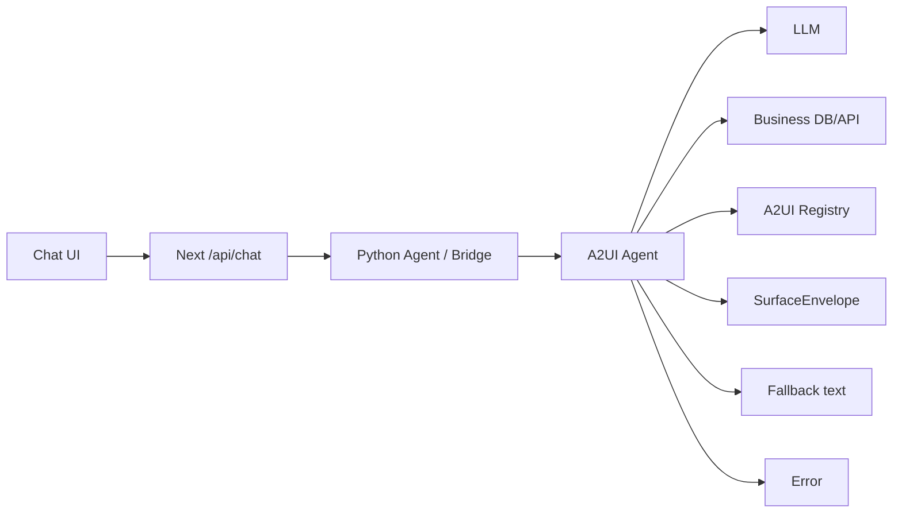

# A2UI Agent Sequence UI Spec

Date: 2026-06-15

## 1. 문서 목적

이 문서는 A2UI Template Admin Chatbot POC의 최종 화면이 어떻게 보여야 하는지 정의한다. 구현 계획서가 아니라 UI/UX 검수 기준 문서다.

이 문서는 계속 수정하면서 점수를 올리는 체크리스트로 사용한다. 최종 완료 기준은 10점 만점에 9.0점 이상이다.

핵심 목표는 사용자가 채팅을 실행했을 때 다음을 한 화면에서 이해하게 만드는 것이다.

- 데이터가 어디서 시작되는지
- 어떤 agent 또는 시스템이 판단하는지
- DB/API, Registry, LLM을 언제 거치는지
- 매칭 성공, 매칭 불가, 실제 오류가 어떤 경로로 갈라지는지
- 현재 실행 로그가 어떤 순서로 쌓이는지

## 2. 점수 기준

현재 점수:

```text
Current score: 9.875 / 10.0
Target score:  >= 9.0 / 10.0
Review date:   2026-06-15
Reviewer:      Codex browser QA
```

점수 운영 규칙:

- 체크리스트 총점은 10.0점이다.
- 각 항목은 `Pass`, `Partial`, `Fail` 중 하나로 평가한다.
- `Pass`는 해당 배점 100%, `Partial`은 해당 배점 50%, `Fail`은 0점으로 계산한다.
- 최종 점수가 9.0점 미만이면 UI 수정이 완료된 것으로 보지 않는다.
- 점수가 9.0점 이상이어도 blocker가 있으면 통과가 아니다.
- 수정할 때마다 아래 점수표의 `Status`, `Score`, `Evidence`, `Next fix`를 갱신한다.

Blocker / 점수 상한 규칙:

| 조건 | 점수 상한 |
| --- | ---: |
| 앱이 로드되지 않거나 주요 패널이 비어 있음 | 6.0 |
| 실제 런타임 이벤트가 아니라 fake/mock animation 중심으로 보임 | 7.0 |
| Canvas drag-pan이 동작하지 않음 | 7.5 |
| Zoom out/in/reset 중 하나라도 동작하지 않음 | 8.0 |
| 매칭 성공과 매칭 불가 fallback이 시각적으로 구분되지 않음 | 8.0 |
| 성공 path에서 fallback warning이 켜짐 | 8.2 |
| body 전체 가로 스크롤이 생김 | 8.5 |
| desktop 또는 mobile에서 주요 텍스트가 겹치거나 잘림 | 8.5 |
| `npm run build` 실패 | 8.5 |
| 콘솔에 반복 React key/error warning이 남음 | 8.8 |

수정 루프:

1. `http://localhost:3001/`에서 desktop 화면을 확인한다.
2. mobile viewport `390 x 844`로 확인한다.
3. 일반 챗팅, 매칭 성공, 매칭 불가, 실제 오류 또는 오류 대체 경로를 확인한다.
4. 체크리스트 점수를 계산한다.
5. 가장 낮은 카테고리부터 수정한다.
6. `npm run lint`, `npm run build`, `npm run python-agent:test`를 다시 확인한다.
7. 9.0점 이상이고 blocker가 없을 때만 완료로 판단한다.

## 3. 전체 레이아웃

기본 desktop 화면은 3분할이다.

```text
┌───────────────────────────────────────────────────────────────┐
│ Top Bar: A2UI Studio / version / Reset demo                    │
├───────────────┬───────────────────────────────┬───────────────┤
│ Admin Panel   │ Agent Sequence Panel           │ Chat Panel    │
│               │ ┌───────────────────────────┐ │               │
│ Templates     │ │ Flow Board Canvas 70%      │ │ A2UI Chat     │
│ Template Edit │ │ pan + zoom + active path   │ │ messages      │
│               │ ├───────────────────────────┤ │ composer      │
│               │ │ System Log 30%             │ │               │
│               │ └───────────────────────────┘ │               │
└───────────────┴───────────────────────────────┴───────────────┘
```

권장 기준:

- 왼쪽 Admin Panel은 템플릿 관리에 집중한다.
- 가운데 Agent Sequence Panel은 이 기능의 주 화면이다.
- 오른쪽 Chat Panel은 입력과 결과 surface 확인에 집중한다.
- 화면 전체는 운영/관리 도구처럼 조용하고 밀도 있게 보여야 한다.
- 랜딩 페이지처럼 보이는 hero, 큰 설명 카드, 장식용 그래픽은 사용하지 않는다.

## 4. 왼쪽 Admin Panel

역할:

- A2UI 템플릿 목록을 보여준다.
- 템플릿 추가/수정 진입점을 제공한다.
- 현재 Registry version과 연결되는 template source라는 느낌을 준다.

표시 기준:

- 패널 제목: `Templates`
- 템플릿 카드에는 이름과 짧은 설명을 표시한다.
- 활성 템플릿은 border나 soft highlight로 구분한다.
- 템플릿이 없어도 레이아웃 높이가 흔들리지 않아야 한다.
- 채팅이나 sequence board보다 시각적 우선순위가 높아지면 안 된다.

## 5. 가운데 Agent Sequence Panel

Agent Sequence Panel은 상단 header, Flow Board Canvas, System Log로 구성한다.

### 5.1 Header

표시 요소:

- Eyebrow: `Agent Sequence`
- Title: `Flow Board`
- 현재 phase badge: `idle`, `request`, `intent`, `surface`, `done` 등
- Registry version badge: `v1` 형식

기준:

- header 높이는 작고 고정적인 느낌이어야 한다.
- phase badge는 현재 상태만 짧게 보여준다.
- 긴 설명 문장은 header에 넣지 않는다.

### 5.2 Flow Board Canvas

Flow Board는 정적인 이미지가 아니라 실행 상태를 반영하는 canvas형 sequence board다.

참여 actor lane:

- `Chat UI`
- `Next /api/chat`
- `Python Agent / Bridge`
- `A2UI Agent`
- `LLM`
- `Business DB/API`
- `A2UI Registry`

중요 기준:

- `Renderer`는 actor lane으로 만들지 않는다.
- A2A/MCP는 actor lane이 아니라 transport detail로 로그에만 표시한다.
- Python Agent와 A2UI Agent는 분리해서 보인다.
- 목표 구조는 A2UI Agent가 intent, data/profile, registry/matcher, surface 생성을 소유하는 흐름으로 보인다.

### 5.3 Canvas Interaction

Flow Board Canvas는 큰 캔버스를 탐색하는 느낌이어야 한다.

필수 인터랙션:

- 마우스로 캔버스를 잡고 드래그하면 좌우/상하로 이동한다.
- `-` 버튼으로 zoom out 할 수 있다.
- `+` 버튼으로 zoom in 할 수 있다.
- `1:1` 버튼으로 기본 zoom과 시작 위치로 돌아간다.
- zoom 상태는 `%`로 표시한다.

검수 기준:

- 줌 컨트롤은 actor label이나 중요한 step label을 가리지 않는다.
- desktop과 mobile 모두에서 zoom control이 화면 밖으로 나가면 안 된다.
- 드래그 중 cursor는 grab/grabbing 느낌이어야 한다.
- zoom 후에도 active step 자동 이동이 엉뚱한 위치로 튀면 안 된다.
- 캔버스 내부 스크롤은 가능하지만 body 전체 가로 스크롤은 생기면 안 된다.

### 5.4 기본 Canvas 상태

빈 상태에서도 전체 구조가 읽혀야 한다.

기준:

- 7개 actor lane이 첫 화면에서 최대한 보인다.
- 불필요한 empty overlay가 다이어그램 중앙을 가리면 안 된다.
- step label은 작지만 읽을 수 있어야 한다.
- branch block은 흐름을 도와야지, 선과 label을 압도하면 안 된다.

기본 step:

- `POST /api/chat`
- `Open /chat/stream`
- `Delegate turn`
- `Intent 판단`
- `Text answer`
- `Business data`
- `Profile / schema`
- `Template contracts`
- `Matcher / mapping`
- `SurfaceEnvelope`
- `No template`
- `Fallback text`
- `Error`

## 6. Branch 표현

시각화는 최소 5개 branch를 구분해야 한다.

| Branch | 의미 | 시각 기준 |
| --- | --- | --- |
| `general` | 일반 챗팅 | Chat으로 바로 text answer가 돌아오는 짧은 경로 |
| `data` | 데이터 기반 A2UI 요청 | DB/API, profile/schema, registry, matcher를 거치는 중심 경로 |
| `matched` | 매칭 성공 | `SurfaceEnvelope` path가 켜짐 |
| `no_template` | 매칭 불가 | fallback text와 `No template` path가 켜짐 |
| `error` | 실제 오류 | fallback과 다른 error path가 켜짐 |

중요 기준:

- 매칭 불가는 오류가 아니다.
- 매칭 성공 path에서 `Fallback text`가 켜지면 안 된다.
- 실제 오류는 `No template`과 다른 색/상태로 보여야 한다.
- 성공 path에서는 `Emit matched summary` 후 `Emit SurfaceEnvelope` 흐름으로 로그가 보여야 한다.

## 7. 실행 중 상태 표현

채팅이 시작되면 다음 변화가 보여야 한다.

- 현재 phase badge가 변한다.
- 해당 step line이 active 상태로 강조된다.
- 완료된 step은 complete 상태로 남는다.
- active packet 또는 glow가 현재 위치를 보여준다.
- inactive branch는 흐리게 처리된다.
- System Log에 같은 이벤트가 순서대로 쌓인다.

권장 실행 흐름:



## 8. System Log

System Log는 Flow Board의 보조 정보가 아니라, 실제 trace를 검증하는 영역이다.

위치:

- Agent Sequence Panel 하단 30%
- dark terminal 스타일
- 내부 스크롤 가능

각 row 표시:

- 시간
- phase
- label
- detail summary

예시:

```text
15:52:23 request          POST /api/chat          장비 상태 목록 보여줘
15:52:23 bridge           Open /chat/stream       registry=v1
15:52:25 intent           Classify as data task   intent=equipment-status | source=llm
15:52:28 matcher          Match template...       mode=render_surface | score=1.00
15:52:28 surface          Emit SurfaceEnvelope    template=equipment.statusBooleanList
15:52:28 done             Completed with surface  strategy=derived_schema
```

기준:

- raw DB rows 전체를 로그에 넣지 않는다.
- 긴 detail은 줄바꿈되더라도 패널 밖으로 밀리면 안 된다.
- error severity는 색으로 구분한다.
- warning severity는 no-template/fallback 성격에만 사용한다.
- 성공 케이스에서 fallback warning이 보이면 안 된다.

## 9. 오른쪽 Chat Panel

역할:

- 사용자가 실제 prompt를 입력한다.
- quick prompt를 실행한다.
- text answer와 A2UI surface 결과를 보여준다.

표시 기준:

- 패널 제목: `A2UI Chat`
- quick prompt: `상태 목록`, `장비 목록`
- composer는 하단에 고정한다.
- 채팅 말풍선은 너무 좁아져 세로로 한 글자씩 떨어지면 안 된다.
- A2UI surface는 채팅 결과 안에서 inspect 가능한 크기로 보여야 한다.

폭 기준:

- desktop에서 Chat Panel은 최소 320px 이상을 유지한다.
- 사용자가 resize할 수 있더라도 중앙 board가 완전히 무너지면 안 된다.
- mobile에서는 Chat Panel이 아래로 쌓인다.

## 10. Responsive 기준

### Desktop

- 3분할이 한 화면에 보여야 한다.
- 중앙 Flow Board는 7개 actor lane이 기본 zoom에서 보이는 것을 우선한다.
- 캔버스는 내부 pan/zoom으로 탐색한다.
- body 전체 가로 스크롤은 없어야 한다.

### Narrow / Mobile

- Admin, Agent Sequence, Chat 순서로 세로 stack된다.
- Flow Board는 내부 canvas scroll/pan/zoom을 유지한다.
- zoom controls는 actor label과 겹치면 안 된다.
- log row는 좁은 폭에서 detail이 다음 줄로 내려가도 된다.
- 텍스트가 버튼이나 카드 밖으로 삐져나오면 안 된다.

## 11. 색상과 밀도

톤:

- 운영 콘솔 느낌의 밝은 회색/흰색 기반
- active 상태는 teal 계열
- system log는 dark terminal 계열
- error는 amber/red 계열

금지:

- 장식용 gradient blob
- 과한 hero형 타이포그래피
- 카드 안에 또 카드가 중첩되는 구조
- 설명 문장이 화면을 차지하는 onboarding UI
- 한 가지 색상 계열만 지배하는 팔레트

## 12. 10점 체크리스트

아래 표는 계속 수정하면서 채워나가는 실전 체크리스트다. `Status`는 `Pass`, `Partial`, `Fail` 중 하나로 기록한다.

### 12.1 Layout / Information Architecture: 1.0점

| Check | Points | Status | Score | Evidence | Next fix |
| --- | ---: | --- | ---: | --- | --- |
| [x] Desktop에서 `Admin | Agent Sequence | Chat` 3분할이 한 화면에 보인다. | 0.25 | Pass | 0.25 | Browser desktop `1170 x 1083`, body width 1170, panel widths 272/568/330 |  |
| [x] Agent Sequence Panel이 중앙 주 화면으로 보이고 좌우 패널보다 묻히지 않는다. | 0.25 | Pass | 0.25 | Trace panel is the widest central work area and owns the board/log split |  |
| [x] Top bar, panel header, badge들이 작고 안정적인 운영 도구 톤을 유지한다. | 0.20 | Pass | 0.20 | Header badges stay compact: `idle/done`, `v1` |  |
| [x] Hero/설명 카드/장식 요소 없이 실제 도구 화면으로 바로 시작한다. | 0.15 | Pass | 0.15 | First screen opens directly to Admin, Flow Board, Chat |  |
| [x] 패널 높이와 경계선이 흔들리지 않고 스크롤 영역이 명확하다. | 0.15 | Pass | 0.15 | Trace grid separates header, canvas, System Log; canvas/log scroll independently |  |

### 12.2 Canvas Navigation: 1.5점

| Check | Points | Status | Score | Evidence | Next fix |
| --- | ---: | --- | ---: | --- | --- |
| [x] Canvas를 마우스로 drag-pan 할 수 있다. | 0.35 | Pass | 0.35 | Browser drag changed canvas scrollTop `0 -> 130`; zoom-in horizontal drag `29 -> 120` |  |
| [x] `-` zoom out이 동작하고 현재 zoom `%`가 갱신된다. | 0.20 | Pass | 0.20 | `Zoom out` updates label to `90%` |  |
| [x] `+` zoom in이 동작하고 layout이 깨지지 않는다. | 0.20 | Pass | 0.20 | `Zoom in` updates to `110%`, canvas remains scrollable |  |
| [x] `1:1` reset이 zoom과 위치를 기본 상태로 되돌린다. | 0.20 | Pass | 0.20 | `Reset zoom` restores `100%` and scroll position to top-left |  |
| [x] Zoom control이 desktop에서 actor/step label을 가리지 않는다. | 0.20 | Pass | 0.20 | Controls moved into toolbar; overlap check returned none |  |
| [x] Zoom control이 mobile에서 actor/step label을 가리지 않는다. | 0.20 | Pass | 0.20 | Mobile `390 x 844` overlap check returned none |  |
| [x] Drag 중 cursor/interaction이 캔버스 조작처럼 느껴진다. | 0.15 | Pass | 0.15 | Canvas uses grab/grabbing cursor states |  |

### 12.3 Sequence Readability: 1.5점

| Check | Points | Status | Score | Evidence | Next fix |
| --- | ---: | --- | ---: | --- | --- |
| [x] 기본 zoom에서 7개 actor lane이 읽힌다. | 0.25 | Pass | 0.25 | `Chat UI` through `A2UI Registry` all visible on desktop |  |
| [x] `Python Agent / Bridge`와 `A2UI Agent`가 분리되어 보인다. | 0.20 | Pass | 0.20 | Separate lane labels and x positions verified |  |
| [x] `Renderer` actor lane이 없다. | 0.15 | Pass | 0.15 | Lane list has 7 actors and no Renderer |  |
| [x] 주요 step label이 겹치거나 카드 밖으로 나가지 않는다. | 0.25 | Pass | 0.25 | Desktop overflow check returned none |  |
| [x] Branch block이 흐름을 돕고 선/라벨을 압도하지 않는다. | 0.20 | Pass | 0.20 | Branch blocks stay low-opacity until active |  |
| [x] Active, complete, muted 상태가 시각적으로 구분된다. | 0.25 | Pass | 0.25 | Matched/no-template runs leave distinct complete paths and muted inactive paths |  |
| [x] Active step 자동 이동이 지나치게 튀거나 사용자의 pan을 방해하지 않는다. | 0.20 | Pass | 0.20 | Active step scroll target stayed inside canvas viewport during smoke flows |  |

### 12.4 Runtime Branch Correctness: 2.0점

| Check | Points | Status | Score | Evidence | Next fix |
| --- | ---: | --- | ---: | --- | --- |
| [x] 일반 챗팅은 `general` branch와 `Text answer` 경로로 보인다. | 0.25 | Pass | 0.25 | Prompt `안녕` produced `general_chat Emit text answer` |  |
| [x] 데이터 요청은 `data` branch로 진입하고 DB/API, profile, registry, matcher를 거친다. | 0.30 | Pass | 0.30 | `장비 상태 목록 보여줘` logs data load, profile, registry, matcher |  |
| [x] 매칭 성공은 `matched` branch와 `SurfaceEnvelope` path로 보인다. | 0.30 | Pass | 0.30 | Matched run completed with `Emit SurfaceEnvelope` and surface UI |  |
| [x] 매칭 성공에서 `Fallback text` warning이 켜지지 않는다. | 0.25 | Pass | 0.25 | Matched run had success rows only for summary/surface/done |  |
| [x] 매칭 불가는 `No template` + `Fallback text` path로 보인다. | 0.25 | Pass | 0.25 | `장비 목록보여줘` completed with `No compatible template` and fallback text |  |
| [~] 실제 오류는 fallback과 다른 `error` path로 보인다. | 0.25 | Partial | 0.125 | Error branch exists for local request errors and SSE errors; no forced browser error in this pass | Add a dev-only error scenario if repeated QA needs visible error-path proof |
| [x] A2A/MCP는 actor가 아니라 transport detail로만 보인다. | 0.20 | Pass | 0.20 | Log shows `transport=a2a`; actor lanes do not include A2A/MCP |  |
| [x] 실제 SSE/trace 이벤트 기반으로 켜지고 fake animation처럼 보이지 않는다. | 0.20 | Pass | 0.20 | Board updates from `/api/chat` SSE events and local request events |  |

### 12.5 System Log: 1.2점

| Check | Points | Status | Score | Evidence | Next fix |
| --- | ---: | --- | ---: | --- | --- |
| [x] Log가 System Log 하단 영역에 시간순으로 쌓인다. | 0.20 | Pass | 0.20 | Runtime rows append under dark System Log region |  |
| [x] `request`, `bridge`, `intent`, `matcher`, `surface`, `done` 등 phase가 읽힌다. | 0.20 | Pass | 0.20 | Matched smoke includes all listed phases |  |
| [x] 긴 detail이 panel 밖으로 밀리지 않고 줄바꿈된다. | 0.20 | Pass | 0.20 | Mobile and desktop overflow checks did not find log text escaping page |  |
| [x] 성공, warning, error severity 색이 구분된다. | 0.20 | Pass | 0.20 | Success and warning classes verified in matched/no-template runs; error style is defined |  |
| [x] raw DB rows 전체가 로그에 노출되지 않는다. | 0.20 | Pass | 0.20 | Logs show row counts/profile summaries, not raw rows |  |
| [x] Log 영역은 내부 스크롤되고 전체 layout을 밀지 않는다. | 0.20 | Pass | 0.20 | Log is fixed to lower trace row with internal overflow |  |

### 12.6 Chat / Admin Panels: 0.8점

| Check | Points | Status | Score | Evidence | Next fix |
| --- | ---: | --- | ---: | --- | --- |
| [x] Chat Panel은 최소 320px 이상으로 말풍선이 읽힌다. | 0.20 | Pass | 0.20 | Desktop chat panel width 330px; resize min remains 320px |  |
| [x] Composer는 하단에 안정적으로 고정된다. | 0.15 | Pass | 0.15 | Composer remains at panel bottom on desktop and below message list on mobile |  |
| [x] Quick prompt 버튼이 작고 명확하며 텍스트가 넘치지 않는다. | 0.15 | Pass | 0.15 | `상태 목록`, `장비 목록` buttons fit without overflow |  |
| [x] A2UI surface 결과가 채팅 안에서 inspect 가능한 크기로 보인다. | 0.20 | Pass | 0.20 | Matched smoke renders status table surface inside chat result |  |
| [x] Admin Panel의 template card가 sequence board보다 시각적으로 튀지 않는다. | 0.10 | Pass | 0.10 | Admin panel narrowed to 272px and uses quiet card styling |  |

### 12.7 Responsive / Mobile: 1.2점

| Check | Points | Status | Score | Evidence | Next fix |
| --- | ---: | --- | ---: | --- | --- |
| [x] Mobile에서 Admin, Agent Sequence, Chat 순서로 세로 stack된다. | 0.20 | Pass | 0.20 | `390 x 844` y order: Admin 117, Trace 366, Chat 1126 |  |
| [x] Mobile에서 body 전체 가로 스크롤이 없다. | 0.20 | Pass | 0.20 | Mobile body scrollWidth/clientWidth = 390/390 |  |
| [x] Mobile에서 canvas 내부 pan/zoom이 유지된다. | 0.20 | Pass | 0.20 | Mobile sequence viewport has internal scrollWidth 568 over clientWidth 390 |  |
| [x] Mobile에서 zoom controls가 actor label과 겹치지 않는다. | 0.20 | Pass | 0.20 | Mobile overlap check returned none |  |
| [x] Mobile에서 log row detail이 자연스럽게 줄바꿈된다. | 0.15 | Pass | 0.15 | Narrow CSS moves detail to the next line |  |
| [x] Mobile에서 버튼/말풍선/카드 텍스트가 부모 밖으로 나가지 않는다. | 0.25 | Pass | 0.25 | Overflow checks found no text escape outside intended canvas scroll |  |

### 12.8 Build / Regression: 0.8점

| Check | Points | Status | Score | Evidence | Next fix |
| --- | ---: | --- | ---: | --- | --- |
| [x] `npm run lint`가 error 없이 통과한다. | 0.20 | Pass | 0.20 | Passed with existing non-blocking `` warning only |  |
| [x] `npm run build`가 통과한다. | 0.25 | Pass | 0.25 | `next build` completed successfully |  |
| [x] `npm run python-agent:test`가 통과한다. | 0.15 | Pass | 0.15 | 7 Python agent tests passed |  |
| [x] Browser console에 반복 React key/error warning이 없다. | 0.10 | Pass | 0.10 | Browser warn/error logs empty after desktop/mobile checks |  |
| [x] 3001/8000/8100 runtime boundary에서 smoke test가 가능하다. | 0.10 | Pass | 0.10 | `lsof` confirmed listeners on 3001, 8000, 8100; UI smoke used all three |  |

## 13. Score Summary

수정할 때마다 이 표를 갱신한다.

| Category | Max | Score |
| --- | ---: | ---: |
| Layout / Information Architecture | 1.0 | 1.0 |
| Canvas Navigation | 1.5 | 1.5 |
| Sequence Readability | 1.5 | 1.5 |
| Runtime Branch Correctness | 2.0 | 1.875 |
| System Log | 1.2 | 1.2 |
| Chat / Admin Panels | 0.8 | 0.8 |
| Responsive / Mobile | 1.2 | 1.2 |
| Build / Regression | 0.8 | 0.8 |
| **Total** | **10.0** | **9.875 / 10.0** |

통과 판정:

- `Total >= 9.0`
- blocker / 점수 상한 규칙에 걸리는 항목 없음
- Runtime Branch Correctness가 최소 1.7점 이상
- Canvas Navigation이 최소 1.3점 이상
- Responsive / Mobile이 최소 1.0점 이상

## 14. Revision Log

| Date | Score | Changed | Remaining next fix |
| --- | ---: | --- | --- |
| 2026-06-15 | 9.875 | Moved zoom controls into board toolbar, verified pan/zoom, desktop/mobile layout, general/matched/no-template branches, build/tests | Optional dev-only visible error scenario for repeatable error-path QA |

## 15. 최종 한 줄 기준

이 UI는 "채팅 결과를 보여주는 화면"이 아니라, A2UI Agent가 데이터와 템플릿을 어떻게 판단해서 UI surface 또는 fallback으로 끝나는지 관측하는 실행형 흐름 보드여야 한다.
