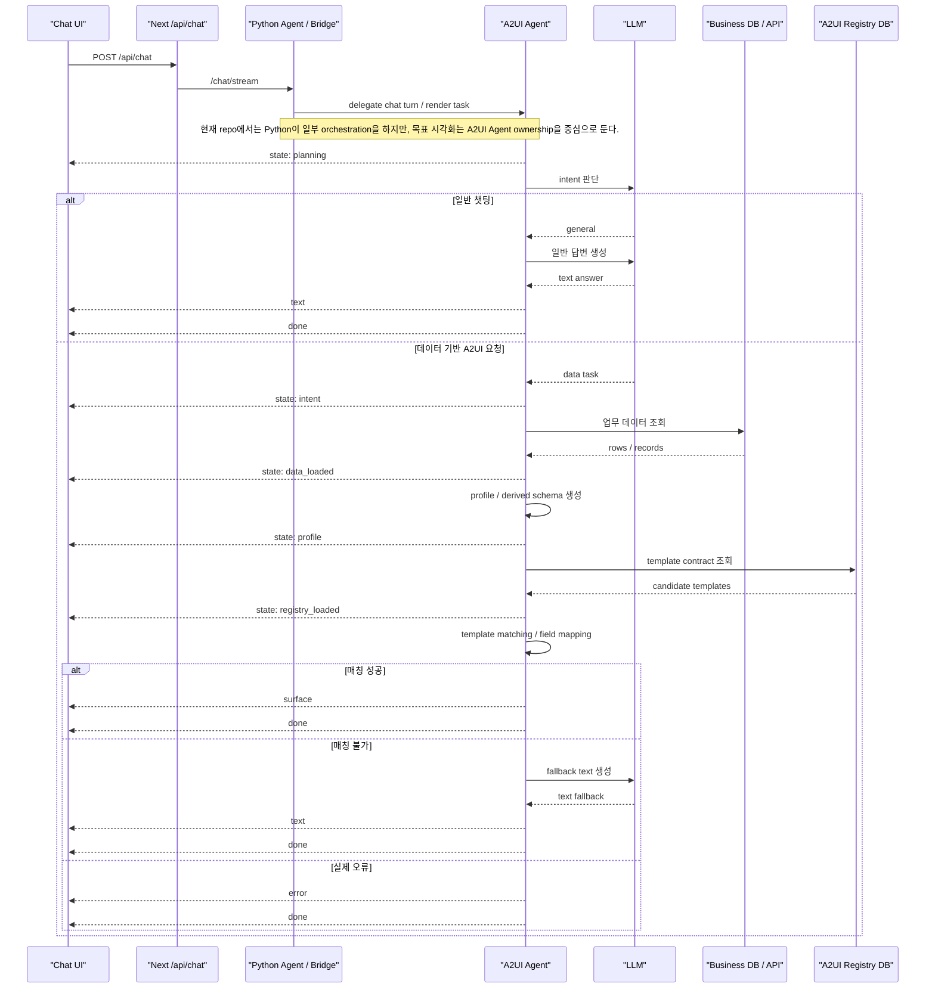

# A2UI Agent Sequence Visualization 개발 계획

Date: 2026-06-15

## 1. 목적

현재 POC 화면은 왼쪽 `AdminPanel`, 오른쪽 `ChatbotPanel` 중심이다. 사용자가 챗을 실행했을 때 데이터가 어디서 만들어지고, 어떤 agent가 무엇을 판단하고, 어느 분기에서 `SurfaceEnvelope` 또는 text fallback으로 끝나는지 한눈에 보기 어렵다.

이 문서는 가운데 영역에 실행형 sequence visualization을 추가하는 개발 계획이다.

목표 화면:

```text
왼쪽: A2UI Template Admin
가운데: Agent Sequence Board
  - 상단 70%: 큰 시퀀스 캔버스
  - 하단 30%: 시스템 로그
오른쪽: Chat
```

핵심은 정적인 UML diagram이 아니라, 챗 요청이 들어올 때 실제 SSE/trace 이벤트에 맞춰 각 단계가 켜지고 로그가 쌓이는 관측 UI를 만드는 것이다.

## TODO 리스트

이 체크리스트는 실제 구현을 시작할 때 위에서부터 순서대로 처리하는 작업 목록이다. 아래 세부 phase의 TODO와 중복되지만, 실행 순서를 빠르게 보기 위해 상단에 모았다.

- [x] 현재 `AdminPanel | ChatbotPanel` 2분할을 `AdminPanel | AgentTracePanel | ChatbotPanel` 3분할로 변경한다.
- [x] `AgentFlowActor`, `AgentFlowPhase`, `AgentFlowEvent` 타입을 추가한다.
- [x] `physicalEmitter`와 logical actor/phase를 분리하는 flow adapter를 추가한다.
- [x] `ChatbotPanel`에 `onFlowEvent` callback을 추가하고 기존 채팅 렌더링은 유지한다.
- [x] query 시작, response open, SSE event 수신, done/error 시점마다 flow event를 생성한다.
- [x] `AgentTracePanel`을 추가해 sequence board와 system log를 같은 event source로 렌더한다.
- [x] HTML/CSS/SVG 기반 `SequenceBoard`를 만든다.
- [x] actor lane은 `Chat UI`, `Next /api/chat`, `Python Agent / Bridge`, `A2UI Agent`, `LLM`, `Business DB / API`, `A2UI Registry DB`로 구성한다.
- [x] 일반 챗팅, 데이터 기반 A2UI, 매칭 성공, 매칭 불가, 실제 오류 branch를 각각 시각적으로 구분한다.
- [x] `SystemLogPanel`을 추가해 event summary를 timestamp 순서로 쌓는다.
- [x] active arrow glow, packet animation, branch dimming, completed state 스타일을 추가한다.
- [x] 현재 SSE만으로 MVP를 검증한다.
- [x] 필요 시 Python `stream_chat_turn()`에 `turnId`, `data_loaded`, `registry_loaded`, `branch`, `physicalEmitter` trace를 추가한다.
- [x] MCP/A2A는 actor로 키우지 않고 transport detail로만 로그/tooltip에 표시한다.
- [x] `npm run build`로 Next build를 확인한다.
- [x] `npm run python-agent:test`로 Python agent 테스트를 확인한다.
- [x] desktop/narrow viewport에서 텍스트 겹침과 scroll/follow 동작을 확인한다.
- [x] 최종적으로 문서의 완료 기준 체크리스트를 업데이트한다.

## 2. 시각화 방향

### 2.1 Sequence Board로 간다

처음에는 decision graph도 후보였지만, 이번 UI의 1차 목표는 사용자가 챗을 눌렀을 때 "지금 어느 actor 사이에서 무슨 일이 진행 중인지"를 보는 것이다. 따라서 메인 시각화는 sequence board가 더 적합하다.

참여 actor:

- `Chat UI`
- `Next /api/chat`
- `Python Agent / Bridge`
- `A2UI Agent`
- `LLM`
- `Business DB / API`
- `A2UI Registry DB`

`Renderer`는 별도 actor로 두지 않는다. 렌더링은 `surface` 이벤트를 Chat UI가 받은 뒤 화면에 표시하는 결과일 뿐, agent/data flow의 핵심 판단 단계가 아니기 때문이다.

중요한 설계 기준:

- 목표 구조에서는 `A2UI Agent`가 intent 판단, DB 조회, profile/schema 생성, template matching, `SurfaceEnvelope` 생성을 소유한다.
- 현재 repo에서는 Python Agent가 그중 일부를 orchestration하고 있다.
- 따라서 시각화는 target logical flow를 `A2UI Agent` 중심으로 그리고, Python Agent는 현재 구현 bridge로 표시한다.
- MCP/A2A는 큰 actor가 아니라 A2UI Agent로 들어가는 현재 transport detail로만 남긴다.

### 2.2 표현할 세 가지 정상 분기

시각화는 다음 케이스를 모두 표현한다.

```text
1. 일반 챗팅
   Chat UI -> Next /api/chat -> Python Agent/Bridge
   -> A2UI Agent -> LLM -> text -> done

2. 데이터 기반 A2UI 매칭 성공
   Chat UI -> Next /api/chat -> Python Agent/Bridge
   -> A2UI Agent -> LLM
   -> Business DB/API -> profile/schema -> A2UI Registry DB
   -> SurfaceEnvelope -> done

3. 데이터 기반 A2UI 매칭 불가
   Chat UI -> Next /api/chat -> Python Agent/Bridge
   -> A2UI Agent -> LLM
   -> Business DB/API -> profile/schema -> A2UI Registry DB
   -> no compatible template -> fallback text -> done
```

실제 오류는 정상 fallback과 분리한다.

```text
DB query failed
LLM unavailable
A2UI Agent unavailable
SurfaceEnvelope validation failed
```

## 3. 기준 시퀀스



이 Mermaid diagram은 문서용 기준이다. 실제 런타임 UI에서는 Mermaid를 렌더링하지 않고, HTML/CSS/SVG 기반 sequence board로 직접 구현한다.

## 4. 현재 repo 기준선

현재 UI 조립 지점:

- `src/features/a2ui-template-poc/poc-page.tsx`
  - 현재 `AdminPanel`과 `ChatbotPanel`을 2분할로 배치한다.

현재 Chat SSE 소비 지점:

- `src/features/a2ui-template-poc/chatbot-panel.tsx`
  - `consumeSse()`로 `/api/chat` 응답을 읽는다.
  - 현재 `text`, `surface`, `state: matcher`, `done`, `error`를 메시지 렌더링에 사용한다.

현재 `/api/chat` proxy:

- `src/app/api/chat/route.ts`
  - Python Agent `/chat/stream`을 그대로 프록시한다.

현재 Python stream 이벤트:

- `packages/a2ui-python-agent/app/orchestrate.py`
  - `planning`
  - `intent`
  - `tool`
  - `profile`
  - `a2a` 또는 `mcp`
  - `matcher`
  - `text`
  - `surface`
  - `done`
  - `error`

현재 A2UI 호출:

- `packages/a2ui-python-agent/app/a2ui_agent.py`
  - 설정에 따라 A2A를 먼저 사용하고, 실패 시 MCP fallback을 사용할 수 있다.
  - 이번 visualization에서는 MCP를 중심 actor로 크게 보여주지 않는다.
  - 현재 구현 설명이 필요할 때만 `transport: a2a|mcp` 정도로 로그에 남긴다.

목표 구조 관점:

- 사용자가 지향하는 방향은 "A2UI Agent가 DB를 읽어서 알아서 처리"하는 구조다.
- 따라서 visualization의 중심 설명은 MCP가 아니라 `A2UI Agent`의 판단 흐름이어야 한다.
- 현재 repo의 Python Agent orchestration은 현재 구현 bridge로 표시한다.
- flow event는 `physical emitter`와 `logical actor`를 분리해서 해석한다. 예를 들어 현재는 Python이 `profile` 이벤트를 emit하더라도 UI에서는 목표 구조에 맞춰 `A2UI Agent profile/schema` 단계로 표시할 수 있다.
- 목표 아키텍처로 갈수록 A2UI Agent 내부 단계가 더 커질 수 있게 설계한다.

## 5. UI 설계

### 5.1 레이아웃

현재:

```text
AdminPanel | ChatbotPanel
```

변경:

```text
AdminPanel | AgentTracePanel | ChatbotPanel
```

권장 폭:

```text
AdminPanel: 320-360px fixed
AgentTracePanel: flex: 1, min-width 620px
ChatbotPanel: 420-620px resizable
```

모바일/좁은 화면:

```text
AdminPanel
AgentTracePanel
ChatbotPanel
```

### 5.2 Sequence Canvas

`AgentTracePanel` 상단 70%는 큰 sequence canvas다.

특징:

- 실제 캔버스 크기는 화면보다 크게 둔다. 예: `1500 x 900`.
- 화면은 그중 일부를 보여준다.
- 실행 중인 step으로 부드럽게 스크롤 또는 pan 한다.
- 각 actor는 세로 lifeline을 가진다.
- 각 step은 HTML 라벨과 SVG arrow로 그린다.
- 실행되지 않은 분기는 흐리게 표시한다.
- 실행된 분기는 선명하게 표시한다.
- active step은 glow와 moving packet으로 강조한다.

권장 visual language:

```text
idle step: 얇은 회색 선
active step: teal glow + moving packet
completed step: 진한 ink 선
inactive branch: 25% opacity
error branch: red/orange line
fallback branch: amber dotted line
surface branch: teal solid line
```

### 5.3 System Log

`AgentTracePanel` 하단 30%는 로그다.

로그는 terminal처럼 보이되, 원본 raw payload를 길게 뿌리지 않는다. 사람이 읽을 수 있는 summary만 남긴다.

예시:

```text
12:31:04 planning       A2UI Agent started chat turn
12:31:05 intent         LLM classified as equipment-status
12:31:05 data_loaded    Business API returned 44 rows
12:31:06 profile        rowCount=44 booleanFields=5 image=false
12:31:07 registry       Loaded 3 template contracts
12:31:07 matcher        matched statusBooleanList score=0.92 candidates=2
12:31:08 surface        SurfaceEnvelope emitted template=statusBooleanList
```

## 6. 컴포넌트 설계

### 6.1 신규 타입

파일 후보:

- `src/features/a2ui-template-poc/agent-flow-types.ts`

```ts
export type AgentFlowActor =
  | "chat"
  | "next"
  | "python_bridge"
  | "a2ui"
  | "llm"
  | "business_db"
  | "registry";

export type AgentFlowPhase =
  | "idle"
  | "planning"
  | "intent"
  | "general_chat"
  | "data_loaded"
  | "profile"
  | "registry_loaded"
  | "matcher"
  | "surface"
  | "no_template"
  | "text_fallback"
  | "error"
  | "done";

export type AgentFlowEvent = {
  id: string;
  turnId: string;
  at: string;
  event: string;
  phase: AgentFlowPhase;
  from?: AgentFlowActor;
  to?: AgentFlowActor;
  label: string;
  detail?: string;
  branch?: "general" | "data" | "matched" | "no_template" | "error";
  severity?: "info" | "success" | "warning" | "error";
  physicalEmitter?: "chat" | "next" | "python-agent" | "a2ui-agent";
  data?: Record<string, unknown>;
};
```

### 6.2 신규 컴포넌트

파일 후보:

- `src/features/a2ui-template-poc/agent-trace-panel.tsx`
- `src/features/a2ui-template-poc/sequence-board.tsx`
- `src/features/a2ui-template-poc/system-log-panel.tsx`

책임:

```text
AgentTracePanel
  - 현재 turn의 events 관리
  - SequenceBoard와 SystemLogPanel에 props 전달

SequenceBoard
  - actor lanes
  - sequence rows
  - alt branch blocks
  - active arrow/packet animation

SystemLogPanel
  - flow events를 timestamp 순으로 렌더
  - severity별 색상
  - payload summary 접기/펼치기
```

### 6.3 ChatbotPanel 변경

`ChatbotPanel`에 optional callback을 추가한다.

```ts
onFlowEvent?: (event: ParsedSseEvent, context: {
  turnId: string;
  query: string;
  registryVersion: number;
}) => void;
```

`consumeSse()` 안에서 기존 메시지 렌더링 로직은 유지하고, 모든 parsed SSE event를 부모로 전달한다.

주의:

- ChatbotPanel이 sequence state를 직접 알면 안 된다.
- ChatbotPanel은 채팅 렌더링과 SSE 소비까지만 책임진다.
- flow event 변환은 부모 또는 별도 adapter에서 한다.

## 7. SSE 이벤트 매핑

현재 이벤트를 다음처럼 매핑한다.

| SSE event | data.status/mode | Logical sequence step | Current physical emitter |
| --- | --- | --- | --- |
| request start | local | `Chat UI -> Next /api/chat` | Chat UI |
| response ok | local | `Next /api/chat -> Python Agent / Bridge` | Chat UI |
| `state` | `planning` | `Python Agent / Bridge -> A2UI Agent`, then `A2UI Agent planning` | Python Agent |
| `state` | `intent` with `label=general` | `A2UI Agent -> LLM`, branch `general` | Python Agent |
| `state` | `intent` with equipment api | `A2UI Agent -> LLM`, branch `data` | Python Agent |
| `state` | `tool` | `A2UI Agent -> Business DB/API` | Python Agent |
| `state` | `profile` | `A2UI Agent self step: profile/schema` | Python Agent |
| `state` | `a2a` | `Python Agent / Bridge -> A2UI Agent`, detail `transport=a2a` | Python Agent |
| `state` | `mcp` | `Python Agent / Bridge -> A2UI Agent`, detail `transport=mcp` | Python Agent |
| `state` | `matcher` with candidates | `A2UI Agent -> A2UI Registry DB`, then matcher result | Python Agent |
| `surface` | any | `A2UI Agent -> Chat UI`, branch `matched` | Python Agent |
| `text` | after general intent | `A2UI Agent -> Chat UI`, branch `general` | Python Agent |
| `text` | after matcher no surface | `A2UI Agent -> Chat UI`, branch `no_template` | Python Agent |
| `error` | any | error branch | Python Agent or Next |
| `done` | `render_surface` | complete matched path | Python Agent |
| `done` | `text_fallback` | complete general or no-template path | Python Agent |
| `done` | `error` | complete error path | Python Agent or Next |

현재 `tool` 이벤트는 "DB/API 호출 시작"만 알려준다. "데이터 로드 완료"는 `profile` 이벤트에서 rowCount를 보고 추론한다. 더 명확한 UI를 위해 Python agent에서 `state: data_loaded`를 추가하는 것을 2단계로 둔다.

현재 repo에서는 Python Agent가 physical emitter인 이벤트가 많다. 하지만 sequence board는 목표 아키텍처를 설명하는 관측 UI이므로, logical sequence step은 A2UI Agent ownership 중심으로 표시한다.

## 8. Animation 선택

### 8.1 1차 구현

1차는 CSS transition/keyframes와 SVG path만으로 구현한다.

이유:

- 현재 `package.json`에는 motion 라이브러리가 없다.
- dependency 추가 없이 빠르게 검증할 수 있다.
- 고정 sequence board는 직접 구현이 더 깔끔하다.

1차 animation:

- active lane pulse
- active arrow glow
- moving packet dot
- completed row fade-in
- inactive branch dim
- current step scroll into view

### 8.2 2차 구현

사용감이 괜찮으면 `framer-motion` 추가를 검토한다.

2차 animation:

- canvas pan/follow
- packet path interpolation
- branch block expand/collapse
- event replay
- hover detail popover

의존성 추가 후보:

```bash
npm install framer-motion
```

단, 실제 구현 전에 Next/React 19와 번들 영향은 `npm run build`로 확인한다.

## 9. 구현 단계

### Phase 1: Trace state plumbing

목표: 기존 채팅 동작을 깨지 않고 flow event를 중앙 패널로 전달한다.

TODO:

- [x] `AgentFlowEvent` 타입 추가
- [x] `poc-page.tsx`에 flow event state 추가
- [x] `ChatbotPanel`에 `onFlowEvent` callback 추가
- [x] query 시작 시 local event 생성
- [x] SSE parsed event를 flow adapter로 전달
- [x] reset demo 시 trace state도 초기화

검증:

- [x] 기존 quick prompt가 그대로 동작한다.
- [x] chat message rendering이 변하지 않는다.
- [x] flow events가 console이 아니라 UI state에 쌓인다.

### Phase 2: Static Sequence Board

목표: 고정 sequence diagram을 중앙 패널에 표시한다.

TODO:

- [x] `AgentTracePanel` 추가
- [x] `SequenceBoard` 추가
- [x] actor lane 7개 렌더
- [x] 고정 step rows 정의
- [x] general/data/matched/no-template/error branch block 표시
- [x] 현재 active phase에 맞춰 step highlight
- [x] inactive branch dim 처리

검증:

- [x] 빈 상태에서 전체 flow가 보인다.
- [x] 채팅 시작 시 `Chat -> Next -> Python` 단계가 켜진다.
- [x] 일반 질문과 장비 질문의 branch가 다르게 켜진다.

### Phase 3: System Log Panel

목표: 같은 flow event를 로그 형태로 쌓는다.

TODO:

- [x] `SystemLogPanel` 추가
- [x] timestamp, phase, label, detail 렌더
- [x] severity 스타일 추가
- [x] matcher score/candidateCount summary 추가
- [x] surface templateId/registryVersion summary 추가
- [x] 최대 로그 길이 제한 또는 현재 turn 중심 표시

검증:

- [x] long payload가 UI를 깨지 않는다.
- [x] 로그가 아래 30% 영역 안에서 scroll된다.
- [x] error 이벤트가 error severity로 보인다.

### Phase 4: Visual polish

목표: "큰 캔버스에서 진행되는 느낌"을 만든다.

TODO:

- [x] sequence board 내부 canvas를 viewport보다 크게 구성
- [x] active step으로 부드럽게 scroll/follow
- [x] active arrow에 packet animation 추가
- [x] branch block에 soft highlight 추가
- [x] current turn badge 추가
- [x] compact desktop에서도 텍스트 겹침 확인
- [x] mobile에서는 sequence board를 horizontal scroll로 전환

검증:

- [x] 1280px, mobile width에서 텍스트가 겹치지 않는다.
- [x] active animation이 chat 입력/스크롤을 방해하지 않는다.
- [x] 캔버스가 너무 빠르게 움직여 읽기 어렵지 않다.

### Phase 5: Backend trace enrichment

목표: UI가 추론하지 않고 실제 runtime event를 더 정확히 받게 한다.

TODO:

- [x] Python `stream_chat_turn()`에 `turnId` 추가
- [x] `state: data_loaded` 추가
- [x] `state: registry_loaded` 추가
- [x] `state: matcher`에 `templateId`, `mode`, `reason` summary 추가
- [x] `done`에 `branch` 추가
- [x] A2A/MCP transport는 actor가 아니라 detail로만 노출
- [x] event마다 `physicalEmitter`와 logical `phase`를 구분할 수 있게 payload 보강
- [x] raw data 전체를 trace event에 넣지 않기

검증:

- [x] `npm run python-agent:test`
- [x] `npm run build`
- [x] local chat smoke로 `general`, `matched`, `no_template/error` 계열 확인

### Phase 6: Target architecture alignment

목표: 장기적으로 "A2UI Agent가 DB를 읽어서 알아서 처리"하는 구조로 갈 때도 시각화가 재사용되게 한다.

TODO:

- [x] sequence board의 기본 모델은 `A2UI Agent -> DB/API -> Registry -> Matcher`로 유지
- [x] 현재 구현의 `Python Agent -> DB/API -> A2UI Agent` 흐름은 adapter에서만 처리
- [x] `physicalEmitter`와 `logicalActor`를 분리해 runtime 이동에도 UI 모델이 유지되게 만들기
- [x] actor labels를 config화
- [x] `Business DB/API` actor를 실제 DB 이름으로 교체 가능하게 만들기
- [x] A2UI Agent 내부 sub-steps를 선택적으로 펼칠 수 있게 설계
- [x] MCP fallback은 primary flow가 아니라 legacy/transport detail로만 유지

## 10. 예상 파일 변경

1차 구현에서 건드릴 파일:

```text
src/features/a2ui-template-poc/poc-page.tsx
src/features/a2ui-template-poc/chatbot-panel.tsx
src/features/a2ui-template-poc/styles.module.css
src/features/a2ui-template-poc/agent-flow-types.ts
src/features/a2ui-template-poc/agent-flow-adapter.ts
src/features/a2ui-template-poc/agent-trace-panel.tsx
src/features/a2ui-template-poc/sequence-board.tsx
src/features/a2ui-template-poc/system-log-panel.tsx
package.json
```

2차 trace enrichment에서 건드릴 파일:

```text
packages/a2ui-python-agent/app/orchestrate.py
packages/a2ui-python-agent/tests/*
```

선택적으로 A2A stream 세분화가 필요하면:

```text
packages/a2ui-python-agent/app/a2a_client.py
packages/a2ui-python-agent/app/a2ui_agent.py
src/server/a2a/a2ui-message-handler.ts
```

## 11. 개발 순서 제안

권장 순서:

1. 프론트-only MVP를 먼저 만든다.
2. 기존 SSE 이벤트만으로 sequence board와 log가 살아나는지 확인한다.
3. 그 다음 Python trace event를 보강한다.
4. 마지막에 animation polish와 optional `framer-motion` 도입을 결정한다.

이 순서가 좋은 이유:

- 현재 chat runtime을 건드리지 않고 UI 가치를 먼저 확인할 수 있다.
- Python bridge/A2A/MCP 현재 구현과 목표 A2UI Agent 구조 사이에서 시각화 모델이 흔들리는지 빨리 볼 수 있다.
- trace event schema가 실제로 필요한 필드만 남게 된다.

## 12. 완료 기준

기능 완료:

- [x] 화면이 `Admin | Sequence Board | Chat` 3분할로 보인다.
- [x] 채팅 시작 시 sequence board에서 현재 진행 단계가 켜진다.
- [x] 일반 챗팅 분기와 데이터 기반 A2UI 분기가 다르게 보인다.
- [x] 매칭 성공 시 `SurfaceEnvelope` path가 켜진다.
- [x] 매칭 불가/fallback 시 fallback path가 켜진다.
- [x] 실제 오류는 fallback과 다른 error path로 보인다.
- [x] 시스템 로그가 이벤트 순서대로 쌓인다.
- [x] 기존 chat surface rendering은 깨지지 않는다.

품질 완료:

- [x] `npm run build` 통과
- [x] `npm run lint` 또는 현재 repo의 lint 상태 확인
- [x] `npm run python-agent:test` 통과 또는 변경 범위상 불필요한 이유 기록
- [x] desktop viewport에서 캔버스/로그/챗 텍스트가 겹치지 않음
- [x] mobile/narrow viewport에서 horizontal scroll 또는 stacked layout이 깨지지 않음

## 13. 주의점

- 이 시각화는 runtime을 증명하는 도구여야 한다. 예쁜 fake animation만 만들면 POC의 신뢰도를 오히려 낮춘다.
- `MCP`를 큰 actor로 강조하지 않는다. 현재 구현 detail로는 남아 있지만, 사용자 목표 구조에서는 A2UI Agent가 중심이다.
- `Renderer`는 actor에서 제외한다. 마지막 UI 표시 결과로 충분하다.
- 매칭 불가는 error가 아니다. `no compatible template -> fallback text` 정상 분기로 보여준다.
- raw DB rows나 큰 payload를 로그에 직접 넣지 않는다. rowCount, templateId, score, strategy, reason 등 summary만 남긴다.
- 현재 Next.js 버전은 repo 규칙상 일반 Next.js 기억으로 가정하면 안 된다. 코드 구현 전에 `node_modules/next/dist/docs/`의 관련 App Router/Route Handler 문서를 확인한다.
