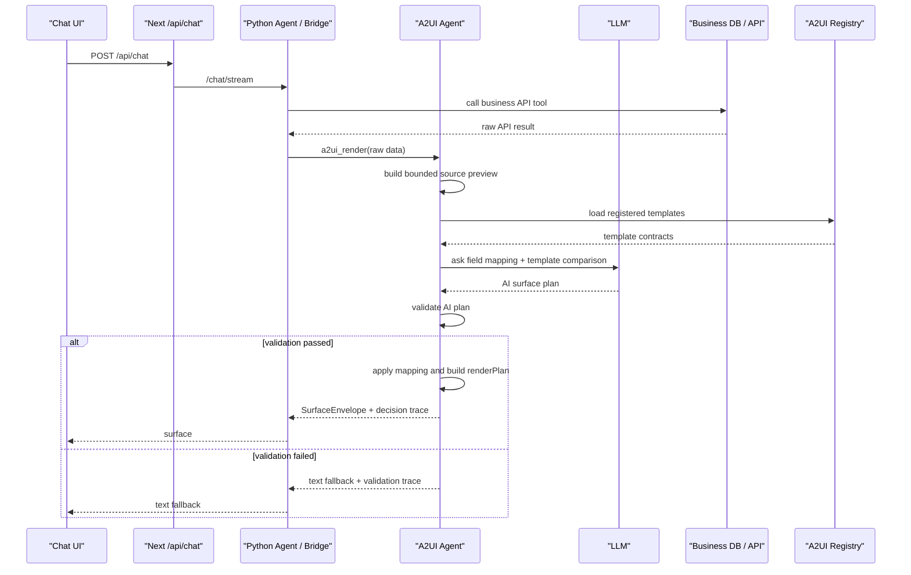

# A2UI AI 스키마 변환 및 템플릿 선택 재설계 계획

작성일: 2026-06-21

## 1. 목적

이번 작업의 목적은 현재 POC에서 대충 이어 붙인 데이터 변환/템플릿 선택 흐름을 원래 의도에 맞게 다시 잡는 것이다.

핵심 방향은 다음과 같다.

```text
Python agent는 raw business API result만 넘긴다.
A2UI 서버가 raw API 데이터를 읽고, AI로 필드 의미를 판단한다.
A2UI 서버가 등록된 여러 A2UI 템플릿을 AI로 비교하고 선택한다.
선택 결과는 숨기지 않고, 어떤 입력과 판단으로 골랐는지 trace로 보여준다.
최종 렌더링 전에는 deterministic validator가 AI plan을 검증한다.
```

즉, "AI가 하는 척"이 아니라 다음 두 판단을 실제 AI 판단으로 만든다.

1. API key / field path를 A2UI가 이해하는 데이터 스키마와 화면 slot으로 변환한다.
2. 여러 A2UI 템플릿 후보 중 어떤 템플릿이 가장 맞는지 비교하고 선택한다.

## 2. 현재 문제

### 2.1 템플릿이 너무 비슷하다

현재 초기 템플릿에는 다음 두 상태 템플릿이 있다.

```text
equipment.commonStatusTable
equipment.statusBooleanList
```

둘 다 다음 조건을 가진다.

```text
shape: array<object>
required: title + boolean status fields
viewType: statusBooleanList
surfaceConfig: name + isOnline/isRunning/hasAlarm/needsInspection/isReserved
```

이 상태로 AI template selection을 붙이면 선택이 흔들릴 가능성이 크다. AI가 나빠서가 아니라 후보 자체가 거의 같은 화면이기 때문이다.

따라서 먼저 데이터와 템플릿의 역할을 다시 나눠야 한다.

### 2.2 wide/large 테스트 API가 canonical key에 너무 가깝다

현재 `컬럼 많은 상태`와 `데이터 많은 상태` 데이터는 대체로 다음 canonical key를 그대로 쓴다.

```text
id
name
isOnline
isRunning
hasAlarm
needsInspection
isReserved
updatedAt
location
```

이러면 AI field mapping을 검증하기 어렵다.

왜냐하면 A2UI 입장에서는 이미 정답 키로 들어온 데이터라서 `copy`만 해도 통과하기 때문이다. 사용자가 확인하고 싶은 것은 "컬럼명이 다르게 생겨도 AI가 의미를 판단해서 A2UI slot에 연결하느냐"이다.

### 2.3 현재 template selection은 아직 AI가 아니다

현재 새로 추가된 A2UI field mapping은 AI를 사용하지만, 템플릿 선택은 아직 `matchA2UITemplate()`의 deterministic score가 중심이다.

목표 상태에서는 다음처럼 바꾼다.

```text
현재:
  AI field mapping
  -> deterministic template matcher
  -> renderer

목표:
  AI surface planner
    - source field meaning 판단
    - template 후보 비교
    - slot mapping 제안
    - 선택 이유 작성
  -> A2UI validator
  -> renderer
```

### 2.4 검수 후 보강할 위험 지점

이 문서 기준으로 실제 구현할 때 헷갈리기 쉬운 지점은 다음이다.

| 위험 지점 | 보강 방향 |
| --- | --- |
| `telemetryStatusTable`은 현재 `A2UIViewType`에 없다. | 타입, renderer, selector, CSS를 함께 추가해야 한다. 템플릿 등록만으로는 화면이 나오지 않는다. |
| `result.rows[]`는 현재 기존 preview/derived schema 계열 코드가 기본으로 읽지 못한다. | AI planner의 source preview는 `items[]`뿐 아니라 nested array path를 명시적으로 지원해야 한다. |
| `items[].telemetry_000..` 같은 wildcard path는 validator가 검증할 수 없다. | AI output에는 실제 존재하는 source path를 각각 나열하게 한다. |
| AI template selection을 붙여도 validator가 약하면 "AI가 골랐다"는 말만 남는다. | sourcePath, slot, transform, type, required slot을 모두 검증하고 실패 시 raw matcher로 우회하지 않는다. |
| 기존 deterministic matcher를 완전히 삭제하면 비교 근거 UI가 빈약해질 수 있다. | 최종 선택권은 AI에 두되, matcher는 validator/evidence 보조값으로만 남긴다. |

## 3. 목표 아키텍처

```text
Business API raw result
  -> A2UI raw data profiler
     - row path 추출
     - field path 추출
     - bounded sample 생성
     - data fingerprint 생성
  -> A2UI AI Surface Planner
     - API field 의미 판단
     - A2UI canonical field / template slot mapping 생성
     - 등록된 template 후보 전체 비교
     - selectedTemplateId 결정
     - 후보별 선택/탈락 이유 작성
  -> A2UI Plan Validator
     - sourcePath 존재 여부 검증
     - transform 허용 목록 검증
     - required slot 충족 검증
     - selected template 존재/등록 상태 검증
     - 변환 후 schema가 template inputSchema와 맞는지 검증
  -> A2UI Plan Applier
     - raw row를 render data로 변환
     - renderPlan.fieldMapping 생성
  -> A2UI Renderer
```

판단 책임은 이렇게 나눈다.

| 영역 | 담당 |
| --- | --- |
| field 의미 판단 | AI |
| template 후보 비교 | AI |
| 최종 template 선택 | AI |
| sourcePath가 실제 있는지 | 코드 validator |
| transform이 안전한지 | 코드 validator |
| required slot이 채워졌는지 | 코드 validator |
| AI가 고른 plan을 실제 data에 적용 | 코드 applier |
| 화면 렌더링 | 기존 A2UI renderer |

요약하면 `판단은 AI`, `검증과 적용은 코드`다.

## 4. 데이터 재기획

### 4.1 시연 API 구성

DB/API 탭은 다음 네 개로 유지한다.

| UI label | API id | 목적 | 기대 template |
| --- | --- | --- | --- |
| 상태 목록 | `equipment-status` | 기준 상태 API | `equipment.commonStatusTable` |
| 장비 목록 | `equipment-catalog` | 이미지/카탈로그 API | `equipment.imageCardList` |
| 컬럼 많은 상태 | `equipment-status-wide-columns` | 많은 컬럼 속에서 필요한 상태/진단 field를 찾는지 검증 | `equipment.telemetryStatusTable` |
| 데이터 많은 상태 | `equipment-status-large-rows` | row가 많아도 bounded sample로 상태 목록을 선택하는지 검증 | `equipment.commonStatusTable` |

`컬럼 많은 상태`와 `데이터 많은 상태`는 둘 다 장비 상태라는 의미는 같게 둔다. 다만 컬럼명과 top-level shape를 일부러 다르게 만들어 AI mapping이 실제로 일어나게 한다.

### 4.2 컬럼 많은 상태 API 설계

목표:

```text
row 수는 적지만 column 수가 많다.
상태 field와 numeric telemetry field가 섞여 있다.
AI는 상태 표보다 telemetry 상태 표가 더 적합하다고 판단해야 한다.
```

응답 shape:

```json
{
  "items": [
    {
      "assetId": "WIDE-001",
      "assetDisplayName": "압력 센서 매트릭스 W001",
      "operStateCd": "ONLINE",
      "runStateYn": "Y",
      "alarmTotalCnt": 2,
      "inspectDueYn": "N",
      "reserveFlag": "N",
      "lastSignalAt": "2026-06-21T10:00:00Z",
      "plantZone": "계측랩-1",
      "telemetry_000": 1000,
      "telemetry_001": 1001,
      "telemetry_002": 1002
    }
  ],
  "total": 6,
  "page": 1,
  "pageSize": 6
}
```

예상 AI field mapping:

| source path | target field / slot | transform |
| --- | --- | --- |
| `items[].assetId` | `id` | `copy` |
| `items[].assetDisplayName` | `name` | `copy` |
| `items[].operStateCd` | `isOnline` | `boolean_code` |
| `items[].runStateYn` | `isRunning` | `boolean_code` |
| `items[].alarmTotalCnt` | `hasAlarm` | `number_to_boolean` |
| `items[].inspectDueYn` | `needsInspection` | `boolean_code` |
| `items[].reserveFlag` | `isReserved` | `boolean_code` |
| `items[].lastSignalAt` | `updatedAt` | `copy` |
| `items[].plantZone` | `location` | `copy` |
| `items[].telemetry_000` | `items[].metrics` | `copy` |
| `items[].telemetry_001` | `items[].metrics` | `copy` |
| `items[].telemetry_002` | `items[].metrics` | `copy` |

선택 기대값:

```text
selectedTemplateId = equipment.telemetryStatusTable
reason = 상태값도 있지만 numeric telemetry field가 많고, 요청이 "컬럼 많은 상태"라서 telemetry 중심 상태 표가 더 적합함
```

주의:

```text
AI output에서는 telemetry_* wildcard를 쓰지 않는다.
validator가 확인할 수 있도록 source.fieldPaths에 있는 실제 path를 각각 반환해야 한다.
```

### 4.3 데이터 많은 상태 API 설계

목표:

```text
row 수가 많다.
컬럼명은 wide API와 비슷하지만 약간 다르다.
top-level array path도 다르게 해서 result.rows[]를 AI가 찾아야 한다.
AI는 telemetry 전용 템플릿이 아니라 일반 상태 목록 템플릿을 선택해야 한다.
```

응답 shape:

```json
{
  "result": {
    "rows": [
      {
        "eqp_id": "BULK-0001",
        "eqp_nm": "대량 검증 셀 0001",
        "operation_yn": "Y",
        "running_code": "RUN",
        "alarm_count": 0,
        "inspection_required": "N",
        "reserved_flag": false,
        "last_dtm": "2026-06-21T11:00:00Z",
        "site_nm": "대량검증-01"
      }
    ],
    "totalCount": 1000,
    "pageNo": 1,
    "rowsPerPage": 1000
  },
  "success": true
}
```

예상 AI field mapping:

| source path | target field / slot | transform |
| --- | --- | --- |
| `result.rows[].eqp_id` | `id` | `copy` |
| `result.rows[].eqp_nm` | `name` | `copy` |
| `result.rows[].operation_yn` | `isOnline` | `boolean_code` |
| `result.rows[].running_code` | `isRunning` | `boolean_code` |
| `result.rows[].alarm_count` | `hasAlarm` | `number_to_boolean` |
| `result.rows[].inspection_required` | `needsInspection` | `boolean_code` |
| `result.rows[].reserved_flag` | `isReserved` | `copy` |
| `result.rows[].last_dtm` | `updatedAt` | `copy` |
| `result.rows[].site_nm` | `location` | `copy` |

선택 기대값:

```text
selectedTemplateId = equipment.commonStatusTable
reason = row 수는 많지만 field 구성은 일반 장비 상태 목록이며, telemetry numeric field가 부족함
```

구현 주의:

```text
source preview는 primaryArrayPath = result.rows를 보존한다.
render data는 renderer가 읽을 수 있도록 최종적으로 items[] 형태로 만든다.
trace에는 source path(result.rows[].eqp_nm)와 render field(items[].name)를 둘 다 남긴다.
rowCount는 rows.length가 아니라 result.totalCount를 우선 사용한다.
page/pageSize는 pageNo/rowsPerPage를 읽어 page/pageSize로 변환한다.
```

### 4.4 중요한 검증 포인트

두 API는 비슷한 의미를 가지지만 key가 다르다.

| 의미 | 컬럼 많은 상태 | 데이터 많은 상태 |
| --- | --- | --- |
| ID | `assetId` | `eqp_id` |
| 이름 | `assetDisplayName` | `eqp_nm` |
| 온라인 | `operStateCd` | `operation_yn` |
| 가동 | `runStateYn` | `running_code` |
| 알람 | `alarmTotalCnt` | `alarm_count` |
| 점검 | `inspectDueYn` | `inspection_required` |
| 예약 | `reserveFlag` | `reserved_flag` |
| 시간 | `lastSignalAt` | `last_dtm` |
| 위치 | `plantZone` | `site_nm` |

이 차이 때문에 hardcoded alias 패턴 없이도 AI 판단이 실제로 필요한 상태가 된다.

구현상 `A2UI_AI_SURFACE_PLANNER_MOCK=1`일 때는 E2E를 안정적으로 돌리기 위해 deterministic mock mapping을 사용한다. 이 mock은 테스트 fixture이며, 운영 경로에서는 A2UI 서버가 source preview와 template contract를 LLM prompt로 보내 field mapping과 template selection을 함께 판단한다.

## 5. 템플릿 재기획

### 5.1 유지할 템플릿

```text
equipment.commonStatusTable
```

역할:

```text
장비 상태 row 목록을 표시한다.
title + 3개 이상의 boolean status flag가 있으면 적합하다.
row 수가 많아도 preview/render maxItems로 일부만 보여준다.
```

required slots:

```text
items[].title: string title/label
items[].statusFlags: boolean status/booleanFlag minCount 3
```

### 5.2 새로 만들 템플릿

```text
equipment.telemetryStatusTable
```

역할:

```text
컬럼이 많은 장비 상태/계측 API를 표시한다.
장비명, 상태값, numeric telemetry/metric field를 함께 보여준다.
```

권장 viewType:

```text
telemetryStatusTable
```

renderer가 새로 필요하다. 기존 `statusBooleanList`를 그대로 쓰면 `commonStatusTable`과 다시 비슷해진다.

현재 코드 기준으로 같이 수정해야 하는 곳:

```text
src/features/a2ui-template-poc/template-types.ts
  - A2UIViewType에 "telemetryStatusTable" 추가

src/features/a2ui-template-poc/a2ui-demo-renderer.tsx
  - telemetryStatusTable 렌더링 분기 추가
  - title/status/metric fieldMapping을 모두 사용

src/features/a2ui-template-poc/component-selector.ts
  - legacy/demo selector가 telemetryStatusTable을 알 수 있게 보조 처리

src/features/a2ui-template-poc/styles.module.css
  - telemetry table 스타일 추가
```

required slots:

```text
items[].title: string title/label
items[].statusFlags: boolean status/booleanFlag minCount 2
items[].metrics: number metric minCount 3
```

selection guide:

```text
컬럼 수가 많고 telemetry/metric field가 여러 개 있으며, 사용자가 컬럼 많은 상태/계측/진단 값을 보고 싶어 할 때 선택한다.
일반 상태 목록처럼 boolean 상태만 많은 데이터에는 사용하지 않는다.
```

### 5.3 중복 템플릿 처리

```text
equipment.statusBooleanList
```

이 템플릿은 다음 중 하나로 정리한다.

권장안:

```text
draft 또는 제거 처리한다.
```

대안:

```text
단일 장비 상태 상세 템플릿으로 역할을 바꾼다.
shape를 array<object>가 아니라 object/detail 중심으로 바꾼다.
required slot을 title + statusFlags가 아니라 selected equipment detail fields로 바꾼다.
```

이번 작업에서는 권장안이 낫다. 같은 `statusBooleanList` viewType을 쓰는 비슷한 템플릿을 둘 이상 등록하면 AI selection 검증이 흐려진다.

## 6. AI Surface Planner 설계

### 6.1 새 서버 모듈

추가 대상:

```text
src/server/a2ui-admin/a2ui-ai-surface-planner.ts
```

주요 함수:

```ts
planA2UISurfaceWithAI(input): Promise<A2UISurfacePlanResult>
buildA2UISurfacePlannerPrompt(input): A2UISurfacePlannerPrompt
requestAISurfacePlan(prompt): Promise<A2UIAISurfacePlan>
validateAISurfacePlan(plan, context): A2UIPlanValidationResult
applyAISurfacePlan(plan, rawData): A2UIPlannedRenderData
```

현재 `a2ui-data-normalizer.ts`는 다음 둘 중 하나로 정리한다.

1. `a2ui-ai-surface-planner.ts` 안으로 흡수한다.
2. field mapping apply/validation 유틸만 남기고, 최종 판단은 surface planner가 하게 한다.

중요한 점은 템플릿 선택까지 포함하는 최종 판단이 새 planner에 있어야 한다는 것이다.

### 6.2 AI 입력

AI에는 raw data 전체를 넣지 않는다. bounded preview와 template contract만 넣는다.

```json
{
  "promptVersion": "2026-06-21.a2ui-surface-plan.v1",
  "task": "Map raw API fields to A2UI fields and choose the best registered A2UI template.",
  "userQuery": "컬럼이 많은 장비 상태 목록 보여줘",
  "apiId": "equipment-status-wide-columns",
  "source": {
    "shape": "object{items:array<object>}",
    "detectedPrimaryArrayPath": "items",
    "rowCount": 6,
    "fieldPaths": [
      "items[].assetId",
      "items[].assetDisplayName",
      "items[].operStateCd",
      "items[].runStateYn",
      "items[].alarmTotalCnt",
      "items[].telemetry_000"
    ],
    "sampleRows": [
      {
        "assetId": "WIDE-001",
        "assetDisplayName": "압력 센서 매트릭스 W001",
        "operStateCd": "ONLINE",
        "runStateYn": "Y",
        "alarmTotalCnt": 2,
        "telemetry_000": 1000
      }
    ]
  },
  "templates": [
    {
      "templateId": "equipment.commonStatusTable",
      "title": "공용 장비 상태 템플릿",
      "viewType": "statusBooleanList",
      "selectionGuide": "...",
      "inputSchema": {
        "requiredSlots": ["items[].title", "items[].statusFlags"],
        "optionalSlots": ["items[].updatedAt", "items[].location"]
      }
    },
    {
      "templateId": "equipment.telemetryStatusTable",
      "title": "계측 상태 테이블",
      "viewType": "telemetryStatusTable",
      "selectionGuide": "...",
      "inputSchema": {
        "requiredSlots": ["items[].title", "items[].statusFlags", "items[].metrics"]
      }
    }
  ],
  "allowedTransforms": [
    "copy",
    "boolean_code",
    "number_to_boolean",
    "default_false"
  ],
  "outputJsonShape": {
    "selectedTemplateId": "string",
    "confidence": "number 0..1",
    "reason": "short Korean sentence",
    "primaryArrayPath": "string",
    "fieldMappings": [],
    "slotMappings": [],
    "candidateEvaluations": []
  }
}
```

### 6.3 System prompt 초안

```text
You are the A2UI server-side surface planner.
You must do two jobs:
1. Map raw business API fields to A2UI display fields and template slots.
2. Compare all registered A2UI template candidates and choose the best one.

Return JSON only.
Do not invent source fields.
Use only source paths listed in source.fieldPaths.
Use transforms only from allowedTransforms.
Prefer the template whose inputSchema can be filled with high confidence and whose selectionGuide matches the user query and source data semantics.
If two templates are similar, explain the tie-breaker using required slots, metric/status/image evidence, row count, and user query.
For every rejected candidate, include the concrete reason.
The final selected template must still satisfy required slots.
For repeated metric/status slots, return one mapping per concrete source path. Do not use wildcard paths.
```

### 6.4 AI 출력

AI 출력은 최종 화면 데이터가 아니라 plan이다.

```json
{
  "selectedTemplateId": "equipment.telemetryStatusTable",
  "confidence": 0.91,
  "reason": "상태 필드와 numeric telemetry 필드가 모두 있어 컬럼 많은 계측 상태 테이블이 가장 적합합니다.",
  "primaryArrayPath": "items",
  "fieldMappings": [
    {
      "targetField": "id",
      "sourcePath": "items[].assetId",
      "transform": "copy",
      "reason": "assetId is a stable equipment identifier"
    },
    {
      "targetField": "name",
      "sourcePath": "items[].assetDisplayName",
      "transform": "copy",
      "reason": "assetDisplayName is the human-readable equipment name"
    },
    {
      "targetField": "isOnline",
      "sourcePath": "items[].operStateCd",
      "transform": "boolean_code",
      "trueValues": ["ONLINE", "ON", "Y"],
      "falseValues": ["OFFLINE", "OFF", "N"],
      "reason": "operStateCd represents online status"
    }
  ],
  "slotMappings": [
    {
      "templateId": "equipment.telemetryStatusTable",
      "slot": "items[].title",
      "sourcePath": "items[].assetDisplayName",
      "targetField": "name",
      "transform": "copy"
    },
    {
      "templateId": "equipment.telemetryStatusTable",
      "slot": "items[].statusFlags",
      "sourcePath": "items[].runStateYn",
      "targetField": "isRunning",
      "transform": "boolean_code"
    },
    {
      "templateId": "equipment.telemetryStatusTable",
      "slot": "items[].metrics",
      "sourcePath": "items[].telemetry_000",
      "transform": "copy"
    }
  ],
  "candidateEvaluations": [
    {
      "templateId": "equipment.telemetryStatusTable",
      "decision": "select",
      "score": 0.91,
      "schemaFit": 0.94,
      "queryFit": 0.88,
      "semanticFit": 0.92,
      "renderFit": 0.9,
      "reason": "Required title, statusFlags, and metrics slots are filled.",
      "missingRequiredSlots": [],
      "risks": []
    },
    {
      "templateId": "equipment.commonStatusTable",
      "decision": "reject",
      "score": 0.78,
      "schemaFit": 0.82,
      "queryFit": 0.72,
      "semanticFit": 0.78,
      "renderFit": 0.74,
      "reason": "Status slots are filled, but the template would ignore the many telemetry columns.",
      "missingRequiredSlots": [],
      "risks": ["Lower render fidelity for wide telemetry data"]
    }
  ]
}
```

출력 규칙:

```text
candidateEvaluations에는 비교 대상 template을 모두 넣는다.
selectedTemplateId와 decision=select인 candidate는 하나만 있어야 한다.
slotMappings.sourcePath는 fieldMappings.sourcePath 중 하나이거나 source.fieldPaths에 직접 존재해야 한다.
같은 slot에 여러 sourcePath가 들어갈 수 있다. 예: items[].metrics, items[].statusFlags
validator는 candidateEvaluations에 등록 template 전체가 정확히 한 번씩 들어갔는지 확인한다.
```

### 6.5 Validator 규칙

AI output은 그대로 믿지 않는다.

검증 규칙:

```text
selectedTemplateId가 catalog에 존재해야 한다.
selected template status가 registered여야 한다.
모든 sourcePath는 source.fieldPaths 안에 있어야 한다.
default_false 외에는 sourcePath가 필수다.
transform은 허용 목록에 있어야 한다.
fieldMappings의 targetField는 A2UI target contract에 있어야 한다.
slotMappings의 slot은 selected template inputSchema에 있어야 한다.
slotMappings.sourcePath는 wildcard가 아니라 실제 source.fieldPaths 중 하나여야 한다.
selected template requiredSlots가 모두 채워져야 한다.
minCount가 있는 slot은 개수를 만족해야 한다.
변환된 sample row의 타입이 slot acceptsTypes와 맞아야 한다.
candidateEvaluations에는 registered template 전체가 있어야 하고, decision=select는 하나만 있어야 한다.
primaryArrayPath가 nested path이면 row extraction과 rowCount metadata가 일관되어야 한다.
검증 실패 시 raw data를 몰래 deterministic matcher에 넣지 않는다.
```

검증 실패 결과:

```text
text fallback
metadata.reason = "AI surface plan failed validation"
metadata.validationErrors = [...]
metadata.aiPlan = sanitized plan
```

## 7. Runtime 변경 계획

### 7.1 A2A handler

수정 대상:

```text
src/server/a2a/a2ui-message-handler.ts
```

현재:

```text
normalizeA2UIRenderData()
recommendTemplate()
resolveTemplateData()
```

목표:

```text
planA2UISurfaceWithAI()
validateAISurfacePlan()
applyAISurfacePlan()
resolveTemplateDataFromPlan()
```

중요:

```text
Python에서 displayData, derivedSchema, sampleDataPreview를 받지 않는다.
rawData만 A2UI planner에 넣는다.
AI planner 실패 시 deterministic matcher로 몰래 fallback하지 않는다.
```

### 7.2 A2UI runtime

수정 대상:

```text
src/server/a2ui-admin/a2ui-runtime.ts
```

현재 `recommendTemplate()`은 deterministic matcher 중심이다. 목표 상태에서는 다음 중 하나로 바꾼다.

권장:

```text
recommendTemplate()을 AI planner 기반으로 바꾸고,
기존 matchA2UITemplate()은 validator/evidence 보조 함수로만 남긴다.
```

대안:

```text
recommendTemplateWithAI()를 새로 만들고 A2A handler에서만 사용한다.
기존 recommendTemplate()은 legacy/demo path로 남긴다.
```

이번 작업에서는 권장안을 따른다. 그래야 "A2UI가 선택한다"는 주요 경로가 하나로 정리된다.

### 7.3 Type 확장

수정 대상:

```text
src/features/a2ui-template-poc/template-types.ts
```

추가/변경:

```ts
type A2UIRenderStrategy =
  | "ai_surface_planner"
  | "derived_schema"
  | "template_schema_spec"
  | "fallback";

type A2UIViewType =
  | "statusBooleanList"
  | "simpleTextList"
  | "imageCardList"
  | "telemetryStatusTable";

type A2UICandidateTrace = {
  templateId: string;
  score: number;
  decision?: "select" | "reject";
  reason: string;
  rejected?: boolean;
  rejectionReason?: string;
  breakdown?: Record<string, number>;
  ai?: {
    schemaFit: number;
    queryFit: number;
    semanticFit: number;
    renderFit: number;
    risks: string[];
    missingRequiredSlots: string[];
  };
};
```

렌더 plan meta에는 다음을 포함한다.

```text
aiPromptVersion
aiModel
aiConfidence
aiReason
candidateEvaluations
slotMappings
fieldMappings
validation
```

## 8. 화면 표시 및 trace 변경

### 8.1 증거 라벨 변경

기존 증거 라벨은 유지하되 내용을 바꾼다.

| 기존 라벨 | 변경 후 의미 |
| --- | --- |
| 실제 API 데이터 | raw business API result와 fingerprint |
| 비교용 데이터로 변환 | AI가 field path를 어떤 의미로 판단했는지 |
| 화면 조건 비교 | AI가 여러 template 후보를 어떻게 비교했는지 |
| 화면 값 연결 | selected template slot에 sourcePath가 어떻게 연결됐는지 |
| 선택된 화면 | AI 선택 + validator 통과 후 최종 surface |

추가 라벨:

```text
AI 판단 결과
```

위치:

```text
A2UI Agent self-loop의 AI Surface Planner 단계
```

팝업 내용:

```text
promptVersion
model
confidence
선택된 template
후보별 score/reason
fieldMappings
slotMappings
validation result
```

### 8.2 고객에게 보여줄 표현

내부 표현:

```text
AI surface planner
candidateEvaluations
slotMappings
validationErrors
```

고객용 표현:

```text
AI가 API 값을 해석했습니다.
등록된 화면들과 비교했습니다.
이 화면을 선택한 이유입니다.
화면 영역에 실제 API 값이 연결되었습니다.
검증을 통과한 뒤 화면으로 표시했습니다.
```

## 9. 시퀀스 다이어그램 변경

현재 시퀀스의 `Build profile / schema`와 `Match template / fields` 사이를 더 명확히 나눈다.

변경 전:

```text
Business API result
-> Build profile / derived schema
-> Load template contracts
-> Match template and fields
-> SurfaceEnvelope
```

변경 후:

```text
Business API result
-> Build bounded source preview
-> Load template contracts
-> AI Surface Planner
   - field meaning mapping
   - template comparison
   - selected template
-> Validate AI plan
-> Apply field/slot mapping
-> SurfaceEnvelope
```

문서용 기준 Mermaid:



Sequence Board 이벤트도 다음처럼 바꾼다.

| Event | Label | Data |
| --- | --- | --- |
| `state:source_preview` | Build source preview | `fieldPaths`, `sampleRows`, `rowCount`, `sourceDataHash` |
| `state:template_contracts` | Load template contracts | template ids, required slots |
| `state:ai_surface_plan` | AI field/template planning | promptVersion, model, selectedTemplateId, candidateEvaluations |
| `state:plan_validation` | Validate AI plan | ok, errors |
| `state:mapping_applied` | Apply field/slot mapping | fieldMappings, slotMappings, beforeRows, afterRows |
| `surface` | Return SurfaceEnvelope | renderPlan, selected template |

## 10. 구현 체크리스트

구현 상태: 2026-06-21 기준 완료. 이 repo에는 별도 TS unit test runner가 없어서 AI 응답 mock 검증은 `A2UI_AI_SURFACE_PLANNER_MOCK=1` production server + HTTP E2E로 수행한다. 운영 경로는 `OPENAI_API_KEY`가 있을 때 LLM을 호출하고, mock alias 판단은 테스트 전용이다.

### Phase 1. 데이터와 템플릿 정리

- [x] `equipment.statusBooleanList`를 draft 처리하거나 제거한다.
- [x] `equipment.commonStatusTable`을 일반 상태 row 목록용으로 유지한다.
- [x] `equipment.telemetryStatusTable` 템플릿을 추가한다.
- [x] `A2UIViewType`에 `telemetryStatusTable`을 추가한다.
- [x] `telemetryStatusTable` viewType renderer를 추가한다.
- [x] `telemetryStatusTable` selector 보조 처리와 CSS를 추가한다.
- [x] `equipment-status-wide-columns` 응답 key를 `assetId`, `assetDisplayName`, `operStateCd`, `runStateYn`, `alarmTotalCnt`, `inspectDueYn`, `reserveFlag`, `lastSignalAt`, `plantZone`, `telemetry_*`로 바꾼다.
- [x] `equipment-status-large-rows` 응답 shape를 `result.rows[]`로 바꾸고 key를 `eqp_id`, `eqp_nm`, `operation_yn`, `running_code`, `alarm_count`, `inspection_required`, `reserved_flag`, `last_dtm`, `site_nm`로 바꾼다.
- [x] Python agent는 새 shape를 normalize하지 않고 raw로 넘긴다.

### Phase 2. AI Surface Planner 추가

- [x] `src/server/a2ui-admin/a2ui-ai-surface-planner.ts`를 추가한다.
- [x] source preview builder가 `items[]`, `rows[]`, `result.rows[]`, `data.rows[]`, `payload.rows[]`를 찾게 한다.
- [x] nested array path의 `totalCount`, `pageNo`, `rowsPerPage`를 rowCount/page/pageSize로 변환한다.
- [x] prompt payload에 source fieldPaths, sampleRows, template contracts를 넣는다.
- [x] AI output shape를 `selectedTemplateId`, `fieldMappings`, `slotMappings`, `candidateEvaluations`로 고정한다.
- [x] `response_format: { type: "json_object" }`를 유지한다.
- [x] `OPENAI_API_KEY`가 없으면 AI 판단 불가를 명시적으로 fallback한다.

### Phase 3. Validator / Applier

- [x] sourcePath 존재 검증을 추가한다.
- [x] transform allowlist 검증을 추가한다.
- [x] selected template required slot 검증을 추가한다.
- [x] 변환된 sample type과 template slot type 검증을 추가한다.
- [x] 후보 비교 결과가 등록 template 전체를 포함하는지 검증한다.
- [x] 검증 실패 시 deterministic matcher로 몰래 우회하지 않는다.
- [x] 검증 성공 시 normalized render data와 renderPlan을 생성한다.

### Phase 4. Runtime 연결

- [x] `a2ui-message-handler.ts`에서 AI planner를 먼저 호출한다.
- [x] `a2ui-runtime.ts`의 `recommendTemplate()`을 AI planner 기반으로 전환한다.
- [x] 기존 `matchA2UITemplate()`은 보조 evidence 또는 validator fallback helper로만 사용한다.
- [x] `A2UIRenderPlan.strategy`에 `ai_surface_planner`를 추가한다.
- [x] surface meta에 AI plan, candidate evaluation, validation result를 넣는다.

### Phase 5. UI / Sequence 반영

- [x] Sequence Board에 `AI Surface Planner` 단계를 추가한다.
- [x] `AI 판단 결과` evidence label을 추가한다.
- [x] 팝업에서 AI 입력 요약과 출력 plan을 보여준다.
- [x] 후보별 선택/탈락 이유를 고객용 문장으로 보여준다.
- [x] field mapping과 slot mapping을 원본 API key -> 화면 영역 -> 실제 표시값 순서로 보여준다.
- [x] Sequence Board 이벤트를 source preview, AI surface plan, plan validation, mapping applied 흐름으로 정리한다.

### Phase 6. 테스트

- [x] AI 응답을 mock한 E2E 검증을 추가한다.
- [x] 실제 LLM 호출 기반 E2E 검증을 추가로 수행한다.
- [x] wide API는 `equipment.telemetryStatusTable`을 선택해야 한다.
- [x] large API는 `equipment.commonStatusTable`을 선택해야 한다.
- [x] sourcePath가 없는 AI plan은 validator에서 실패해야 한다.
- [x] wildcard sourcePath를 반환한 AI plan은 validator에서 실패해야 한다.
- [x] required slot이 부족한 AI plan은 validator에서 실패해야 한다.
- [x] `result.rows[]` 입력은 source path와 render data path를 둘 다 trace에 남겨야 한다.
- [x] `OPENAI_API_KEY`가 없을 때 raw matcher로 몰래 성공하지 않아야 한다.
- [x] E2E에서 `normalizationTrace` 대신 `aiSurfacePlanTrace` 또는 동등한 trace를 확인한다.

검증 명령:

```bash
npm run build
npm run lint
PYTHONPATH=packages/a2ui-python-agent python3 -m unittest discover packages/a2ui-python-agent/tests
A2UI_AI_SURFACE_PLANNER_MOCK=1 ./node_modules/.bin/next start -p 3012
A2UI_E2E_BASE_URL=http://localhost:3012 node scripts/e2e-a2ui-data-boundary.mjs
A2UI_AI_SURFACE_PLANNER_MOCK= ./node_modules/.bin/next start -p 3014
A2UI_E2E_BASE_URL=http://localhost:3014 node scripts/e2e-a2ui-data-boundary.mjs
OPENAI_API_KEY= A2UI_AI_SURFACE_PLANNER_MOCK= ./node_modules/.bin/next start -p 3013
# 별도 A2A 요청으로 no-key fallback 확인:
# hasSurface=false, reason="A2UI AI surface planning requires OPENAI_API_KEY."
```

검증 결과:

```text
build: pass
lint: pass, existing @next/next/no-img-element warning 1건
python unittest: 30 tests OK
data boundary E2E:
  wide columns -> equipment.telemetryStatusTable
  large rows -> equipment.commonStatusTable
  raw alias status -> equipment.commonStatusTable
  nested alias status -> equipment.commonStatusTable
real AI data boundary E2E:
  wide columns -> equipment.telemetryStatusTable
  large rows -> equipment.commonStatusTable
  raw alias status -> equipment.commonStatusTable
  nested alias status -> equipment.commonStatusTable
no-key fallback:
  surface 미생성
  OPENAI_API_KEY 필요 사유 명시
```

실제 LLM 검증 중 발견해 수정한 지점:

```text
1. LLM이 legacy mappings 객체를 반환하던 문제
   -> response_format을 json_schema structured output으로 바꾸고 top-level plan shape를 강제했다.

2. LLM이 등록되지 않은 templateId와 임의 targetField를 생성하던 문제
   -> response schema에 allowedTemplateIds, sourcePaths, allowedTargetFields enum을 동적으로 넣었다.

3. LLM이 slotMappings.slot에 실제 template slot이 아니라 target field를 넣던 문제
   -> response schema에 registered template의 allowedSlots enum을 동적으로 넣었다.

4. LLM이 operation_yn을 isRunning으로 잘못 해석하던 문제
   -> canonicalFieldHints와 operationRunningRule을 prompt에 추가해 operation/online과 running 의미를 분리했다.
```

## 11. 완료 기준

이번 작업이 끝났다고 볼 수 있는 기준은 다음이다.

```text
1. wide/large 두 API의 컬럼명이 canonical key가 아니다.
2. 두 API의 컬럼명은 의미는 비슷하지만 서로 다르다.
3. Python은 raw API result만 전달한다.
4. A2UI 서버의 AI planner가 field mapping과 template selection을 모두 판단한다.
5. AI가 선택한 후보와 탈락 후보의 이유가 trace에 남는다.
6. validator가 AI plan을 검증한다.
7. 검증 실패 시 deterministic matcher로 몰래 성공하지 않는다.
8. wide API는 telemetryStatusTable을 선택한다.
9. large API는 commonStatusTable을 선택한다.
10. Sequence Board와 팝업에서 AI 판단 입력/출력/검증 결과를 볼 수 있다.
```

최종 고객 메시지는 이렇게 정리한다.

```text
A2UI는 API 컬럼명을 고정 규칙으로 맞추는 것이 아니라, AI가 원본 필드의 의미와 등록된 화면 조건을 함께 판단해 화면을 선택합니다. 그리고 그 판단은 검증 가능한 trace로 남습니다.
```
