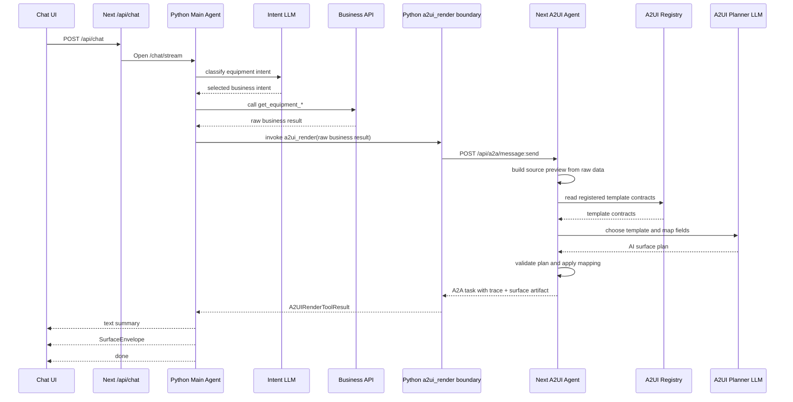

# A2UI Runtime Sequence Redesign Plan

작성일: 2026-06-21

## 목적

현재 Sequence 보드는 실제 런타임 흐름과 A2UI 내부 판단 trace를 한 줄의 시퀀스처럼 섞어서 보여준다. 그래서 `Send compare payload` 다음에 바로 `then matched: SurfaceEnvelope`로 넘어간 것처럼 보이고, 중간의 `Build source preview`, `AI Surface Planner`, `Validate AI plan`, `Apply field/slot mapping` 단계가 실제로 호출된 것인지, 그냥 화면용으로 만든 것인지 구분하기 어렵다.

이 문서의 목표는 전체 시퀀스를 실제 코드 경계 기준으로 다시 설계하는 것이다.

## 검수 결과

문서의 큰 방향은 맞다. 다만 구현으로 바로 들어가기 전에 아래 세 가지를 더 명확히 해야 한다.

1. `trace-derived`는 "가짜 단계"라는 뜻이 아니다. 실제 A2UI 내부 로직은 실행된다. 다만 현재 Chat UI가 그 단계를 live progress event로 받은 것이 아니라, A2UI 결과 artifact 또는 SurfaceEnvelope에 들어 있는 trace를 사후 표시한다는 뜻이다.
2. rich AI 판단 trace의 실제 위치는 A2A surface artifact의 `decision.aiSurfacePlanTrace`와 SurfaceEnvelope의 `payload.renderPlan.aiSurfacePlanTrace`다. Chat UI 상태로 변환된 뒤에는 `message.surface.renderPlan.aiSurfacePlanTrace`에서 읽어야 한다. `surface.meta.trace`는 짧은 문자열 breadcrumb라서 상세 판단 근거로 쓰면 부족하다.
3. 현재 `sequence-board.tsx` detail UI에는 demo trace 전용 필드인 `aiSurfacePlanTrace.rules`, `displayRowCount` 참조가 남아 있다. 실제 서버 trace는 `fieldMappings`, `slotMappings`, `renderRowCount`, `beforeRows`, `afterRows`를 쓴다. 구현 시 이 필드 차이를 반드시 정리해야 한다.

## 먼저 정리해야 할 결론

`a2ui_render Tool`은 A2UI 서버가 아니다.

현재 코드에서 `a2ui_render`는 Python Main Agent 쪽 render boundary wrapper다. 이 wrapper가 raw business result를 받아 A2A 요청을 만들고, Next의 A2UI Agent로 `POST /api/a2a/message:send`를 보낸다.

A2UI 템플릿 비교, AI field mapping, template 선택, renderer payload 생성은 Next 서버의 A2UI Agent 안에서 수행된다.

따라서 시퀀스는 다음처럼 읽혀야 한다.

1. Main Agent가 business API를 조회한다.
2. Main Agent가 Python `a2ui_render` wrapper를 호출한다.
3. Python wrapper가 raw data를 A2A render request로 감싸 A2UI Agent에 보낸다.
4. A2UI Agent가 raw data와 등록된 템플릿 contract를 AI planner에 넣어 비교한다.
5. A2UI Agent가 AI plan을 검증하고 mapping을 적용한다.
6. A2UI Agent가 SurfaceEnvelope artifact를 반환한다.
7. Main Agent가 그 artifact를 Chat UI로 stream한다.

## 현재 화면이 헷갈리는 이유

### 1. `Send compare payload`의 대상이 잘못 읽힌다

현재 Sequence 보드에서는 `Main Agent -> a2ui_render Tool` 라벨이 `Send compare payload`로 보인다.

하지만 실제 의미는 "A2UI 서버로 compare payload를 직접 보낸다"가 아니라 "Python 내부의 `a2ui_render` boundary wrapper를 실행한다"에 가깝다.

고쳐야 할 라벨:

| 현재 | 변경 |
| --- | --- |
| `a2ui_render Tool` | `Python render boundary` 또는 `A2A render client` |
| `Send compare payload` | `Invoke a2ui_render boundary` |
| 없음 | `POST /api/a2a/message:send` 단계 추가 |

### 2. A2UI 내부 단계가 실제 live stream처럼 보인다

현재 Python stream은 `a2ui_tool_call` 이벤트를 보낸 뒤 `_run_a2ui_tool(...)`을 `await`한다. 그리고 A2UI 호출이 모두 끝난 뒤 `profile`, `a2a`, `registry_loaded`, `matcher`, `a2ui_tool_result`, `text`, `surface`, `done` 이벤트를 순서대로 emit한다.

즉 현재 화면의 A2UI 내부 단계는 대부분 "실시간으로 A2UI 서버가 보내준 progress event"가 아니다. A2UI 호출 결과에 포함된 metadata/trace를 Main Agent가 받은 뒤, UI adapter가 그것을 단계처럼 해석해서 그리는 구조다.

이 구분이 화면에 드러나야 한다.

| 종류 | 의미 | 화면 표현 |
| --- | --- | --- |
| observed runtime event | 실제 SSE 또는 transport boundary에서 관측된 이벤트 | 굵은 실선 |
| trace-derived evidence | 실제 실행된 A2UI 내부 판단을 결과 artifact/SurfaceEnvelope에서 사후 해석한 evidence | 점선, badge: `trace` |
| optional future live event | 추후 A2A stream으로 만들 수 있는 실제 progress | 현재는 숨기거나 비활성 표시 |

### 3. `Build source preview` 위치가 잘못 읽힌다

Python `render_boundary.py`는 profile/sample/derived schema를 만들지만, 현재 A2UI 판단에는 `display_data=None`, `derived_schema=None`, `sample_data_preview=None`로 넘긴다.

A2UI AI planner가 사용하는 source preview는 Next 서버의 `planA2UISurfaceWithAI(...)` 내부에서 raw data를 기준으로 다시 만든다.

따라서 Sequence에서 `Build source preview`를 `a2ui_render Tool -> A2UI Agent` 메시지처럼 그리면 오해가 생긴다.

고쳐야 할 표현:

- Python boundary: `Attach source metadata`
- A2UI Agent 내부: `Build A2UI source preview from raw data`

### 4. `then matched: SurfaceEnvelope` branch가 너무 빨리 시작된다

SurfaceEnvelope branch는 `A2UI Agent -> Python render boundary -> Main Agent`로 validated surface artifact가 돌아온 뒤에만 시작되어야 한다.

현재처럼 `Send compare payload` 근처에서 바로 matched branch가 시작되는 것처럼 보이면, 중간 단계가 의미 없는 장식처럼 보인다.

## 실제 런타임 시퀀스



## 새 Sequence 보드 actor 설계

| Actor | 역할 | 주의점 |
| --- | --- | --- |
| `Chat UI` | 사용자 입력, SSE 수신, surface 렌더 | surface card는 `event:surface` 이후에만 의미 있음 |
| `Next /api/chat` | browser와 Python agent 사이 stream proxy | A2UI 판단 주체 아님 |
| `Main Agent` | 의도 분류, business API 선택, raw result 수신 | A2UI template 선택 주체 아님 |
| `Business API` | mock/business data 반환 | 컬럼명이 A2UI schema와 달라도 raw로 보존되어야 함 |
| `Python render boundary` | `a2ui_render` wrapper, A2A client | A2UI 서버가 아님 |
| `A2UI Agent` | Next A2A handler, AI planner 실행, SurfaceEnvelope 생성 | field mapping/template selection의 주체 |
| `A2UI Registry` | 등록된 template contract 제공 | template 비교 입력 |
| `A2UI Planner LLM` | raw fields와 template contract를 보고 plan 반환 | 선택/변환 판단의 AI 주체 |

## 새 Sequence step 설계

| Step id | From | To | Label | Kind | Source |
| --- | --- | --- | --- | --- | --- |
| `request` | Chat UI | Next /api/chat | `POST /api/chat` | observed | local UI event |
| `bridge` | Next /api/chat | Main Agent | `Open /chat/stream` | observed | `response_open` |
| `planning` | Main Agent | Main Agent | `Plan turn` | observed | `state:planning` |
| `intent` | Main Agent | Intent LLM | `Classify intent` | observed | `state:intent` |
| `business-tool-call` | Main Agent | Business API | `Call business API` | observed | `state:business_tool_call` |
| `business-tool-result` | Business API | Main Agent | `Raw business result` | observed | `state:business_tool_result` |
| `a2ui-boundary-call` | Main Agent | Python render boundary | `Invoke a2ui_render boundary` | observed | `state:a2ui_tool_call` |
| `a2a-send` | Python render boundary | A2UI Agent | `POST /api/a2a/message:send` | inferred transport | wrapper uses A2A client |
| `a2ui-source-preview` | A2UI Agent | A2UI Agent | `Build source preview from raw data` | trace-derived | `decision.aiSurfacePlanTrace.source*` 또는 `surface.payload.renderPlan.aiSurfacePlanTrace.source*` |
| `registry-request` | A2UI Agent | A2UI Registry | `Load template contracts` | trace-derived today | `planA2UISurfaceWithAI()` reads catalog before AI call |
| `ai-planner` | A2UI Agent | A2UI Planner LLM | `Compare API schema and templates` | trace-derived today | `decision.aiSurfacePlanTrace`, `candidateEvaluations` |
| `plan-validation` | A2UI Agent | A2UI Agent | `Validate AI plan` | trace-derived | `aiSurfacePlanTrace.validation` |
| `mapping-applied` | A2UI Agent | A2UI Agent | `Apply field/slot mapping` | trace-derived | `fieldMappings`, `slotMappings`, `beforeRows`, `afterRows`, `renderRowCount` |
| `a2a-result` | A2UI Agent | Python render boundary | `Return trace + surface artifact` | inferred transport | A2A task artifact |
| `a2ui-tool-result` | Python render boundary | Main Agent | `Return A2UIRenderToolResult` | observed | `state:a2ui_tool_result` |
| `matched-summary` | Main Agent | Chat UI | `Return text summary` | observed | `event:text` |
| `surface` | Main Agent | Chat UI | `Return SurfaceEnvelope` | observed | `event:surface` |
| `done` | Main Agent | Chat UI | `Complete turn` | observed | `event:done` |

## UI 변경 계획

### 1. Actor 이름부터 바꾼다

`src/features/a2ui-template-poc/sequence-board.tsx`

- `a2ui_render Tool`을 `Python render boundary`로 변경한다.
- 필요하면 lane id는 유지하되, 화면 label만 바꾼다.
- tooltip/detail에는 `Python wrapper that calls the A2UI Agent over A2A`라고 설명한다.

### 2. `Send compare payload`를 두 단계로 나눈다

현재:

```text
Main Agent -> a2ui_render Tool: Send compare payload
```

변경:

```text
Main Agent -> Python render boundary: Invoke a2ui_render boundary
Python render boundary -> A2UI Agent: POST /api/a2a/message:send
```

이렇게 해야 "Main Agent가 A2UI 서버로 직접 넘긴다"는 오해가 사라진다.

### 3. A2UI 내부 판단은 trace-derived panel로 분리한다

`Build source preview`, `Load template contracts`, `AI Surface Planner`, `Validate AI plan`, `Apply field/slot mapping`은 기본 Sequence의 live stream 행처럼 보이면 안 된다.

표현 방식:

- A2UI Agent lane 안에 묶음 박스: `A2UI internal decision trace`
- 각 단계에 `trace` badge 표시
- 클릭하면 `aiSurfacePlanTrace`, `mapping`, `candidates`, `beforeRows`, `afterRows`를 보여준다.
- live event가 아니라는 설명을 짧게 붙인다: `derived from returned A2UI trace`

trace source 우선순위:

1. A2A surface artifact의 `decision.aiSurfacePlanTrace`
2. raw `event:surface` payload의 SurfaceEnvelope `payload.renderPlan.aiSurfacePlanTrace`
3. Chat UI 상태로 변환된 뒤의 `message.surface.renderPlan.aiSurfacePlanTrace`
4. fallback으로 `surface.meta.trace` 문자열 breadcrumb는 사용 가능하지만, 상세 popup 근거로는 부족하다.

### 4. matched branch 시작 위치를 늦춘다

`then matched: SurfaceEnvelope` branch는 아래 이후에만 시작한다.

```text
A2UI Agent -> Python render boundary: Return trace + surface artifact
Python render boundary -> Main Agent: Return A2UIRenderToolResult
```

그 전까지는 `data` branch 안에 있어야 한다.

### 5. 실제 event와 추론 event를 구분한다

`AgentFlowEvent`에 아래와 같은 분류 필드를 추가하거나, 기존 `physicalEmitter`/`event`를 기반으로 derived flag를 만든다.

```ts
type AgentFlowEventKind =
  | "observed"
  | "inferred_transport"
  | "trace_derived";
```

최소 변경으로는 `AgentFlowEvent`에 `evidenceKind?: "observed" | "inferred_transport" | "trace_derived"`를 추가한다.

## Adapter 변경 방향

대상 파일:

- `src/features/a2ui-template-poc/agent-flow-adapter.ts`
- `src/features/a2ui-template-poc/agent-flow-types.ts`
- `src/features/a2ui-template-poc/sequence-board.tsx`

변경 방향:

1. `state:a2ui_tool_call`은 `Main Agent -> Python render boundary`로만 표시한다.
2. `state:a2a` 또는 `state:registry_loaded`가 오면, 이것을 "A2UI Agent가 live로 보냈다"로 표시하지 않는다.
3. `matcher`, `a2ui_tool_result`, `payload.renderPlan.aiSurfacePlanTrace`, A2A artifact의 `decision.aiSurfacePlanTrace`가 있으면 A2UI internal trace steps를 생성한다.
4. 생성된 internal trace steps는 `trace_derived`로 표시한다.
5. `surface` 이벤트는 반드시 `Main Agent -> Chat UI`의 실제 결과로만 표시한다.
6. `no_template` branch는 `done.mode === "text_fallback"` 또는 `matcher.mode === "no_template"`일 때만 표시한다.

현재 주의점:

- Python `extract_a2ui_result()`는 surface artifact에서 `surface`, `reason`, `strategy`, `score`, `candidates`, `mapping`, `sourceTool`, `dataIntegrity`만 꺼낸다.
- rich trace인 `decision.aiSurfacePlanTrace`는 Python `A2UIResponse` metadata로 보존되지 않는다.
- 따라서 live Sequence detail에서 rich trace를 쓰려면 `event:surface`의 SurfaceEnvelope 안에 있는 `payload.renderPlan.aiSurfacePlanTrace` 또는 Chat state의 `message.surface.renderPlan.aiSurfacePlanTrace`를 읽거나, Python extractor가 `aiSurfacePlanTrace`를 metadata로 보존하게 고쳐야 한다.
- demo trace 전용 필드인 `rules`, `displayRowCount`는 실제 서버 trace의 `fieldMappings`, `slotMappings`, `renderRowCount`로 대체해야 한다.

## Backend streaming을 진짜로 만들 경우

현재 설계는 "거짓 live progress를 없애는" 쪽이다.

만약 A2UI 내부 단계까지 실제로 live sequence로 보여주고 싶으면 backend도 바꿔야 한다.

필요한 변경:

1. Next A2A handler가 `message:stream`에서 progress artifact/update를 단계별로 emit한다.
2. Python `A2UIA2AClient.stream_message(...)`를 render path에서 사용한다.
3. Python `_run_a2ui_tool(...)`이 A2UI progress를 `/chat/stream`으로 relay한다.
4. Chat UI는 relay된 `a2ui_progress` 이벤트만 live step으로 표시한다.
5. 최종 SurfaceEnvelope artifact는 기존처럼 `event:surface`로 표시한다.

현재 route에는 `POST /api/a2a/message:stream`이 있지만, 이것만으로 충분하지 않다. 현재 Python render path는 `send_message(...)`를 사용하고, Next의 `buildA2AStreamEvents(...)`도 `renderTask(...)` 완료 후 working/completed/artifact events를 배열로 반환한다. 단계별 live progress로 만들려면 Next stream을 async generator 형태로 바꾸고, Python이 그 stream을 relay해야 한다.

이 변경을 하기 전까지는 A2UI 내부 단계가 live event인 것처럼 보이면 안 된다.

## 수용 기준

- 사용자가 Sequence만 보고 "누가 누구에게 무엇을 보냈는지" 설명할 수 있어야 한다.
- `a2ui_render`가 A2UI 서버가 아니라 Python wrapper라는 점이 화면에서 드러나야 한다.
- API key 변환과 template 선택의 주체가 A2UI Agent + A2UI Planner LLM이라는 점이 드러나야 한다.
- `Build source preview`가 Python에서 A2UI로 전달된 것처럼 보이면 안 된다.
- `then matched: SurfaceEnvelope`는 A2UI plan/validation/mapping 결과가 반환된 뒤에만 시작되어야 한다.
- live event와 trace-derived evidence가 시각적으로 구분되어야 한다.
- no-template branch가 surface 렌더와 동시에 보이면 실패다.

## 검증 계획

### 코드 검증

```bash
npm run lint
npm run build
```

### Python 경계 검증

```bash
python -m unittest discover packages/a2ui-python-agent/tests
```

### A2UI 데이터 경계 E2E

```bash
A2UI_E2E_BASE_URL=http://localhost:3001 node scripts/e2e-a2ui-data-boundary.mjs
```

### 브라우저 수동 검증

아래 요청을 각각 실행한다.

```text
컬럼이 많은 장비 상태 목록 보여줘
데이터가 많은 장비 상태 목록 보여줘
```

확인할 것:

- `a2ui_render` lane label이 Python boundary로 보인다.
- `POST /api/a2a/message:send`가 명시적으로 보인다.
- A2UI 내부 단계는 trace-derived로 표시된다.
- Surface card는 `Return SurfaceEnvelope` 이후 결과로 보인다.
- `no_template` branch와 surface branch가 동시에 강조되지 않는다.

## 작업 순서

1. Sequence actor/lane 이름을 실제 책임 기준으로 변경한다.
2. step definition을 실제 runtime boundary와 trace-derived step으로 재분류한다.
3. adapter에서 A2UI 내부 trace steps를 `trace_derived`로 생성한다.
4. `then matched` branch 시작점을 `a2ui_tool_result` 이후로 이동한다.
5. click detail popup에 evidence kind와 source event를 표시한다.
6. detail popup의 demo trace 필드(`rules`, `displayRowCount`)를 실제 trace 필드(`fieldMappings`, `slotMappings`, `renderRowCount`)로 교체한다.
7. live trace source를 `payload.renderPlan.aiSurfacePlanTrace`에서 읽을지, Python extractor metadata에 보존할지 결정하고 구현한다.
8. wide-column, large-row 두 시나리오를 브라우저에서 직접 검증한다.
9. 필요하면 별도 문서로 backend streaming 전환 계획을 작성한다.

## 이번 수정에서 하지 않을 것

- A2UI field mapping을 Python으로 되돌리지 않는다.
- alias/pattern 기반 key 변환으로 대체하지 않는다.
- 내부 trace를 실제 streaming event처럼 꾸미지 않는다.
- 단순히 label만 예쁘게 바꿔서 문제를 덮지 않는다.
