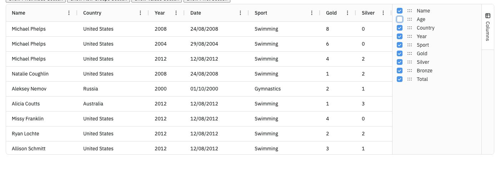
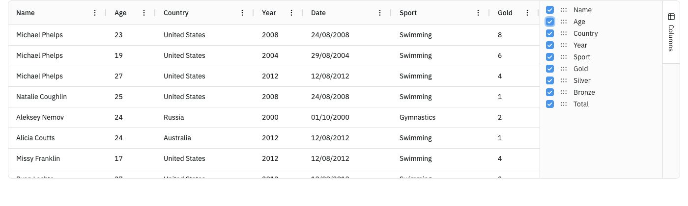
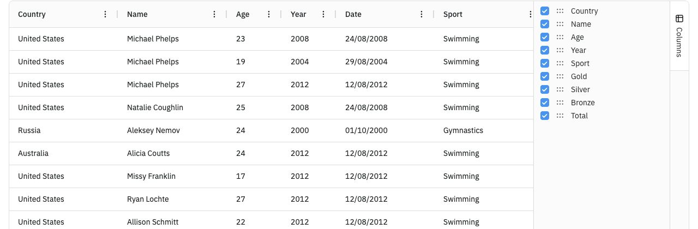
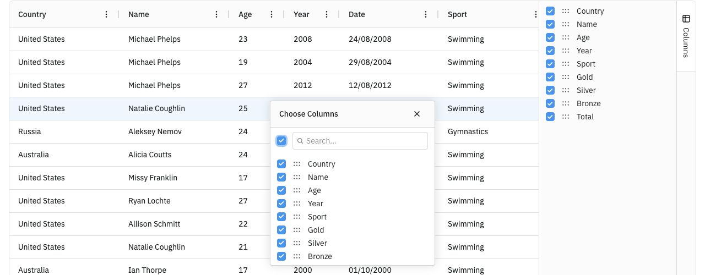

# AG Grid 컬럼 개인화 기능 리서치

- 조사일: 2026-09-08
- 확인 기준: AG Grid 공식 문서 v36.1.0 및 공식 TypeScript 실행 예제
- 범위: 컬럼 순서 변경, 숨김·다시 표시, 개인별 설정 저장 방식
- 이 문서는 기능 조사와 구현 제안이다. 이 저장소에 기능을 구현하거나 사용자별 DB 저장을 검증한 결과는 아니다.

## 1. 결론

AG Grid에서 컬럼 순서 변경, 숨김·다시 표시, 상태 추출·복원이 가능하다. Enterprise는 컬럼 설정 패널과 선택 팝업을 기본 제공한다. Community에서도 컬럼 API와 상태 API를 사용해 같은 개인화를 구현할 수 있지만, 체크박스 설정 UI는 직접 만들어야 한다.

사용자별 영구 저장은 애플리케이션에서 연결한다. AG Grid의 상태 추출 API로 설정을 얻고, 사용자와 화면을 기준으로 저장한 뒤 다음 방문에 복원하는 구조다.

출처: [Community vs. Enterprise](https://www.ag-grid.com/javascript-data-grid/community-vs-enterprise/), [Column State](https://www.ag-grid.com/javascript-data-grid/column-state/)

## 2. 숨긴 컬럼을 다시 표시하는 방법

오른쪽 **Columns Tool Panel**은 숨겨진 컬럼을 포함한 전체 컬럼 목록을 보여준다. 일반 표 모드, 즉 Pivot Mode가 꺼진 상태에서는 체크 해제하면 컬럼이 숨겨지고 다시 체크하면 표시된다. 컬럼 정의를 삭제하는 것이 아니라 표시 여부를 변경한다.

### Age를 숨긴 상태

표에서 Age가 사라져도 오른쪽 목록에는 Age가 체크 해제된 상태로 남아 있다.



### Age를 다시 체크한 상태

오른쪽 Age 체크박스를 다시 켜면 표의 Age 컬럼이 복원된다. 이 숨김·복원 동작을 공식 데모에서 직접 확인했다.



직접 설정창을 만들 때도 목록의 기준은 **현재 보이는 컬럼이 아니라 전체 설정 대상 컬럼**이어야 한다. 그래야 숨긴 컬럼을 다시 켤 수 있다.

`hide: true`는 표에서 숨기는 설정이다. 반면 `suppressColumnsToolPanel: true`는 설정 패널 목록에서 해당 컬럼을 제외하는 옵션이다. 사용자가 다시 켤 컬럼에는 후자를 적용하지 않는다.

출처: [Columns Tool Panel](https://www.ag-grid.com/javascript-data-grid/tool-panel-columns/)

## 3. 컬럼 순서 변경

헤더를 드래그해 위치를 바꿀 수 있다. 기본 설정에서는 Columns 패널 목록의 순서도 표와 동기화된다. 패널 내부에서도 컬럼 순서를 변경할 수 있으며, 관련 옵션으로 이동을 제한할 수 있다.

아래는 공식 데모에서 Country 헤더를 맨 앞으로 드래그한 결과다. 표와 오른쪽 목록 모두 `Country → Name → Age` 순서로 바뀌었다.



출처: [Columns Tool Panel — Suppress Column Reordering](https://www.ag-grid.com/javascript-data-grid/tool-panel-columns/#suppress-column-reordering)

## 4. 컬럼별 메뉴와 설정 팝업

헤더의 **⋮ → Choose Columns**를 누르면 전체 컬럼을 선택하는 팝업이 열린다. 숨긴 컬럼의 헤더를 찾을 필요 없이 다른 컬럼 메뉴에서도 설정에 접근할 수 있다.



이 팝업은 Enterprise 기능이다. 표 위에 별도의 **컬럼 설정** 버튼을 만들고 아래 API로 열 수도 있다.

```js
// Enterprise ColumnMenuModule 등록 필요
api.showColumnChooser();
```

제품에서는 항상 접근할 수 있는 컬럼 설정 버튼을 두는 방식을 권한다. 모든 컬럼을 숨긴 경우에도 설정을 다시 열 수 있기 때문이다.

출처: [Column Menu](https://www.ag-grid.com/javascript-data-grid/column-menu/)

## 5. 무료·유료 기능 구분

| 기능 | Community 무료 | Enterprise 유료 |
| --- | --- | --- |
| 헤더 드래그로 순서 변경 | 가능 | 가능 |
| API로 컬럼 숨김·표시 | 가능 | 가능 |
| 컬럼 상태 추출·복원 | 가능 | 가능 |
| 기본 Columns Tool Panel / Column Chooser | 제공하지 않음; 외부 설정 UI 직접 구현 | 기본 제공 |
| 사용자별 DB 저장 | 애플리케이션에서 연결 | 애플리케이션에서 연결 |

Community에서 직접 만드는 설정 UI는 AG Grid 외부의 일반 버튼·팝업·체크박스로 구성하면 된다. Enterprise의 Side Bar나 Custom Tool Panel 기능을 무료 기능으로 혼동하지 않는다.

출처: [버전별 기능](https://www.ag-grid.com/javascript-data-grid/community-vs-enterprise/), [Grid API](https://www.ag-grid.com/javascript-data-grid/grid-api/)

## 6. 개인화 저장 구조

권장 흐름은 다음과 같다.

1. 사용자가 컬럼 순서와 표시 여부를 변경한다.
2. **내 설정 저장** 버튼에서 컬럼 상태를 추출한다.
3. 사용자 ID와 화면 ID를 기준으로 상태를 저장한다.
4. 다음 방문에 해당 화면의 컬럼이 준비되면 저장 상태를 적용한다.
5. **기본값 복원**은 기본 컬럼 설정을 적용하고 저장된 개인 설정도 초기화한다.

같은 브라우저에서만 유지하려면 `localStorage`, 다른 PC에서도 로그인한 사용자 설정을 유지하려면 서버 DB 저장을 사용한다. 이는 애플리케이션 설계 제안이다.

### 순서와 표시 여부만 저장하는 최소 예시

아래 코드는 API 사용 개념 예시다. `api`는 생성된 Grid API이며 `savedState`는 저장소에서 읽어온 값이다. 실제 연결 시 모듈 등록, 저장 API, 오류 처리와 호출 시점이 필요하다.

```js
// 컬럼 ID는 화면 개편 전후에도 안정적으로 유지한다.
const columnDefs = [
  { field: 'name', colId: 'name' },
  { field: 'age', colId: 'age' },
  { field: 'country', colId: 'country' },
];

// 현재 순서와 표시 여부만 추출한다.
const state = api.getColumnState().map(({ colId, hide }) => ({
  colId,
  hide,
}));

// 애플리케이션에서 사용자 ID + 화면 ID 기준으로 state를 저장한다.

// 다음 방문에 저장 상태를 읽어 적용한다.
api.applyColumnState({
  state: savedState,
  applyOrder: true,
});
```

배열의 순서가 컬럼 순서이며 `hide: true`가 숨김이다. 너비·고정·정렬 등도 저장하려면 저장 대상 속성을 추가한다. 전체 `getColumnState()` 결과에는 다른 컬럼 상태도 포함되므로 요구사항에 맞춰 선택한다.

컬럼 추가·삭제에 대비해 저장 데이터에 화면 설정 버전을 두고, 복원 시 현재 컬럼 ID와 대조하는 처리를 권한다. `applyColumnState()`는 찾지 못한 컬럼이 있으면 `false`를 반환한다.

### 체크박스와 API 연결 예시

```js
// 해당 컬럼 숨김
api.setColumnsVisible(['age'], false);

// 해당 컬럼 다시 표시
api.setColumnsVisible(['age'], true);

// 컬럼 정의에 지정한 기본 상태로 복원
api.resetColumnState();
```

`resetColumnState()`는 그리드 상태를 초기화한다. DB나 localStorage에 저장한 개인 설정까지 자동 삭제하지 않으므로 서비스에서 함께 처리한다.

필터·페이지 등 그리드 전체 상태까지 저장할 요구가 생기면 `Grid State`의 `api.getState()`, `initialState`, `api.setState()`도 검토할 수 있다.

출처: [Column State](https://www.ag-grid.com/javascript-data-grid/column-state/), [Grid API](https://www.ag-grid.com/javascript-data-grid/grid-api/), [Grid State](https://www.ag-grid.com/javascript-data-grid/grid-state/)

## 7. 적용 제안 및 검증 범위

이 요구에는 **컬럼 설정 + 내 설정 저장 + 기본값 복원** 구성을 제안한다. Enterprise 사용 중이라면 기본 설정 UI를 연결하고, Community라면 전체 컬럼 체크박스 팝업을 직접 구현한다.

공식 데모에서 직접 확인한 범위는 Age 숨김·복원, Country 헤더 드래그 이동, 헤더 메뉴의 Choose Columns 팝업이다. 상태 저장·복원 API와 지원 범위는 공식 문서로 확인했다. 서비스의 DB 저장, 새로고침 후 복원, 사용자 계정 간 분리, 다른 기기에서의 복원은 구현 후 별도 검증해야 한다.

프로젝트의 현재 AG Grid 설치 여부·버전·라이선스는 이번 조사에서 확인하지 않았다. 도입 시 설치 버전에 맞는 API와 모듈 구성을 확인한다.

## 8. 직접 확인할 공식 자료

- [조작 및 캡처에 사용한 컬럼 패널 데모](https://www.ag-grid.com/examples/tool-panel-columns/section-visibility/typescript/)
- [컬럼 상태 저장·복원 데모](https://www.ag-grid.com/examples/column-state/save-apply-state/typescript/)
- [Columns Tool Panel](https://www.ag-grid.com/javascript-data-grid/tool-panel-columns/)
- [Column Menu / Column Chooser](https://www.ag-grid.com/javascript-data-grid/column-menu/)
- [Column State](https://www.ag-grid.com/javascript-data-grid/column-state/)
- [Grid State](https://www.ag-grid.com/javascript-data-grid/grid-state/)
- [Grid API](https://www.ag-grid.com/javascript-data-grid/grid-api/)
- [Community vs. Enterprise](https://www.ag-grid.com/javascript-data-grid/community-vs-enterprise/)
